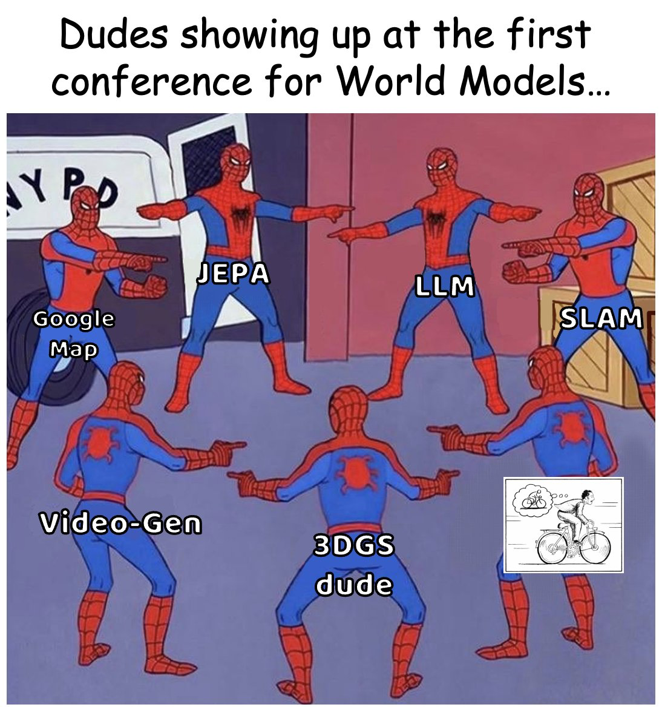

<div align="center">

# 🌍 Awesome World Models


[](https://github.com/sindresorhus/awesome) [](https://github.com/knightnemo/Awesome-World-Models/stargazers) [](LICENSE.txt) [](CONTRIBUTING.md)

**📜 A Curated List of Amazing Works in World Modeling, spanning applications in Embodied AI, Autonomous Driving, Natural Language Processing and Agents.** </br>
*Based on [Awesome-World-Model-for-Autonomous-Driving](https://github.com/LMD0311/Awesome-World-Model) and [Awesome-World-Model-for-Robotics](https://github.com/leofan90/Awesome-World-Models)*.
<p align="center">
  
</p>

*Photo Credit: [Gemini-Nano-Banana🍌](https://aistudio.google.com/models/gemini-2-5-flash-image)*.
</div>

---

## 🚩 News & Updates
_Major updates and announcements are shown below. Scroll for full timeline._

🚀 **[2025-11] 1k+ Stars ⭐️ Under 30 Days** — 🌍 [Awesome World Models](https://github.com/knightnemo/Awesome-World-Models) reached 1k github stars within 30 days of initial release, let's go!!!

🗺️ **[2025-10] Enhanced Visual Navigation** — Introduced badge system for papers! All entries now display [](#) [](#) [](#) for quick access to resources.

🔥 **[2025-10] Repository Launch** — Awesome World Models is now live! We're building a comprehensive collection spanning Embodied AI, Autonomous Driving, NLP, and more. See [CONTRIBUTING.md](CONTRIBUTING.md) for how to contribute.

💡 **[Ongoing] Community Contributions Welcome** — Help us maintain the most up-to-date world models resource! Submit papers via PR or contact us at [email](mailto:siqiaohuang981@gmail.com).

⭐ **[Ongoing] Support This Project** — If you find this useful, please [cite](#citation) our work and give us a star. Share with your research community!


---
## Overview

  - 🎯 [Aim of the project](#aim-of-the-project)
  - 📚 [Definition of World Models](#definition-of-world-models)
  - 📖 [Surveys of World Models](#surveys-of-world-models)
  - 🎮 [World Models for Game Simulation](#world-models-for-game-simulation)
  - 🚗 [World Models for Autonomous Driving](#world-models-for-autonomous-driving)
  - 🤖 [World Models for Embodied AI](#world-models-for-embodied-ai)
  - 🔬 [World Models for Science](#world-models-for-science)
  - 💭 [Positions on World Models](#positions-on-world-models)
  - 📐 [Theory & World Models Explainability](#theory--world-models-explainability)
  - 🛠️ [General Approaches to World Models](#general-approaches-to-world-models)
  - 📊 [Evaluating World Models](#evaluating-world-models)
  - 🙏 [Acknowledgements](#acknowledgements)
  - 📝 [Citation](#citation)

---

## Aim of the Project

World Models have become a hot topic in both research and industry, attracting unprecedented attention from the AI community and beyond. However, due to the **interdisciplinary nature** of the field (_and because the term "world model" simply sounds amazing_), the concept has been used with varying definitions across different domains.

<p align="center">
  
</p>

This repository aims to:

- 🔍 **Organize** the rapidly growing body of world model research across multiple application domains
- 🗺️ **Provide** a minimalist map of how world models are utilized in different fields (Embodied AI, Autonomous Driving, NLP, etc.)
- 🤝 **Bridge** the gap between different communities working on world models with varying perspectives
- 📚 **Serve** as a one-stop resource for researchers, practitioners, and enthusiasts interested in world modeling
- 🚀 **Track** the latest developments and breakthroughs in this exciting field

Whether you're a researcher looking for related work, a practitioner seeking implementation references, or simply curious about world models, we hope this curated list helps you navigate the landscape! 

---

## Definition of World Models
While world models' outreach has been expanded again and again, it is widely adopted that the original sources of world models come from these two papers:
* [⭐️] **World Models**, World Models. [](https://arxiv.org/abs/1803.10122) [](https://worldmodels.github.io/) 
* [⭐️] **Yann Lecun's Speech**, "A Path Towards Autonomous Machine Intelligence". [](https://openreview.net/pdf?id=BZ5a1r-kVsf)

Some other great blogposts on world models include:
- [⭐️] **Towards Video World Models**, "Towards Video World Models". [](https://www.xunhuang.me/blogs/world_model.html)
- **Status of World Models in 2025**, "Beyond the Hype: How I See World Models Evolving in 2025". [](https://knightnemo.github.io/blog/posts/wm_2025/)
- [⭐️] **Jim Fan's tweet**. [](https://x.com/DrJimFan/status/1709947595525951787)

---
## Surveys of World Models

### 1. World Models and Video Generation:
- [⭐️] **Is Sora a World Simulator**, "Is Sora a World Simulator? A Comprehensive Survey on General World Models and Beyond". [](https://arxiv.org/abs/2405.03520) [](https://github.com/GigaAI-research/General-World-Models-Survey)
- **Physics Cognition in Video Generation**, "Exploring the Evolution of Physics Cognition in Video Generation: A Survey". [](https://arxiv.org/abs/2503.21765) [](https://github.com/minnie-lin/Awesome-Physics-Cognition-based-Video-Generation)

### 2. World Models and 3D Generation:
- [⭐️] **3D and 4D World Modeling: A Survey**, "3D and 4D World Modeling: A Survey". [](https://arxiv.org/abs/2509.07996)
- [⭐️] **Understanding World or Predicting Future?**, "Understanding World or Predicting Future? A Comprehensive Survey of World Models". [](https://arxiv.org/abs/2411.14499)
- **From 2D to 3D Cognition**, "From 2D to 3D Cognition: A Brief Survey of General World Models". [](https://arxiv.org/abs/2506.20134)

### 3. World Models and Embodied Artificial Intelligence:
- [⭐️] **World Models for Embodied AI**, "A Comprehensive Survey on World Models for Embodied AI". [](https://arxiv.org/abs/2510.16732) [](https://github.com/Li-Zn-H/AwesomeWorldModels)
- **World Models and Physical Simulation**, "A Survey: Learning Embodied Intelligence from Physical Simulators and World Models". [](https://arxiv.org/abs/2507.00917) [](https://github.com/NJU3DV-LoongGroup/Embodied-World-Models-Survey)
- **Embodied AI Agents: Modeling the World**, "Embodied AI Agents: Modeling the World". [](https://arxiv.org/abs/2506.22355)
- **Aligning Cyber Space with Physical World**, "Aligning Cyber Space with Physical World: A Comprehensive Survey on Embodied AI". [](https://arxiv.org/abs/2407.06886) [](https://github.com/HCPLab-SYSU/Embodied_AI_Paper_List)

### 4. World Models for Autonomous Driving:
- [⭐️] **A Survey of World Models for Autonomous Driving**, "A Survey of World Models for Autonomous Driving". [](https://arxiv.org/abs/2501.11260)
- **World Models for Autonomous Driving: An Initial Survey**, "World Models for Autonomous Driving: An Initial Survey". [](https://arxiv.org/abs/2403.02622)
- **Interplay Between Video Generation and World Models in Autonomous Driving**, "Exploring the Interplay Between Video Generation and World Models in Autonomous Driving: A Survey". [](https://arxiv.org/abs/2411.02914)

### 5. Other Good Surveys:
- **From Masks to Worlds**, "From Masks to Worlds: A Hitchhiker's Guide to World Models". [](https://arxiv.org/abs/2510.20668) [](https://github.com/M-E-AGI-Lab/Awesome-World-Models)
- **The Safety Challenge of World Models**, "The Safety Challenge of World Models for Embodied AI Agents: A Review". [](https://arxiv.org/abs/2510.05865)
- **World Models in AI: Like a Child**, "World Models in Artificial Intelligence: Sensing, Learning, and Reasoning Like a Child". [](https://arxiv.org/abs/2503.15168)
- **World Model Safety**, "World Models: The Safety Perspective". [](https://arxiv.org/abs/2411.07690)
- **Model-based reinforcement learning**: "A survey on model-based reinforcement learning".  [](https://link.springer.com/article/10.1007/s11432-022-3696-5)
- **On Memory: A comparison of memory mechanisms in world models**: "On Memory: A comparison of memory mechanisms in world models". [](https://www.arxiv.org/abs/2512.06983)


---

## World Models for Game Simulation
Pixel Space:
- [⭐️] **GameNGen**, "Diffusion Models Are Real-Time Game Engines". [](https://arxiv.org/abs/2408.14837) 
- [⭐️] **DIAMOND**, "Diffusion for World Modeling: Visual Details Matter in Atari".  [](https://arxiv.org/abs/2405.12399) [](https://github.com/eloialonso/diamond)
- **MineWorld**, "MineWorld: a Real-Time and Open-Source Interactive World Model on Minecraft". [](https://arxiv.org/abs/2504.07257) [](https://aka.ms/mineworld)
- **Oasis**, "Oasis: A Universe in a Transformer". [](https://oasis-model.github.io/)
- **AnimeGamer**, "AnimeGamer: Infinite Anime Life Simulation with Next Game State Prediction". [](http://arxiv.org/abs/2504.01014)[](https://howe125.github.io/AnimeGamer.github.io/)
- [⭐️] **Matrix-Game**, "Matrix-Game: Interactive World Foundation Model." [](https://arxiv.org/abs/2506.18701) [](https://github.com/SkyworkAI/Matrix-Game)
- [⭐️] **Matrix-Game 2.0**, Matrix-Game 2.0: An Open-Source, Real-Time, and Streaming Interactive World Model. [](https://arxiv.org/abs/2508.13009) [](https://matrix-game-v2.github.io/)
- **RealPlay**, "From Virtual Games to Real-World Play". [](https://arxiv.org/abs/2506.18901) [](https://wenqsun.github.io/RealPlay/) [](https://github.com/wenqsun/Real-Play)
- **GameFactory**, "GameFactory: Creating New Games with Generative Interactive Videos". [](http://arxiv.org/abs/2501.08325) [](https://yujiwen.github.io/gamefactory/) [](https://github.com/KwaiVGI/GameFactory)
- **WORLDMEM**, "Worldmem: Long-term Consistent World Simulation with Memory". [](http://arxiv.org/abs/2504.12369) [](https://xizaoqu.github.io/worldmem/) [](https://github.com/xizaoqu/WorldMem)


3D Mesh Space:
- [⭐️] **HunyuanWorld 1.0**, HunyuanWorld 1.0: Generating Immersive, Explorable, and Interactive 3D Worlds from Words or Pixels. [](https://arxiv.org/abs/2507.21809) [](https://3d-models.hunyuan.tencent.com/world/) [](https://github.com/Tencent-Hunyuan/HunyuanWorld-1.0)
- [⭐️] **Matrix-3D**, Matrix-3D: Omnidirectional Explorable 3D World Generation. [](https://arxiv.org/abs/2508.08086) [](https://matrix-3d.github.io)


---
## World Models for Autonomous Driving
_Refer to https://github.com/LMD0311/Awesome-World-Model for full list._

> [!NOTE]
> 📢 [Call for Maintenance] The repo creator is no expert of autonomous driving, so this is a more-than-concise list of works without classification. We anticipate community effort on turning this section cleaner and more well-sorted.

- [⭐️] **Cosmos-Drive-Dreams**, "Cosmos-Drive-Dreams: Scalable Synthetic Driving Data Generation with World Foundation Models". [](https://arxiv.org/abs/2506.09042) [](https://research.nvidia.com/labs/toronto-ai/cosmos_drive_dreams)
- [⭐️] **GAIA-2**, "GAIA-2: A Controllable Multi-View Generative World Model for Autonomous Driving". [](https://arxiv.org/abs/2503.20523) [](https://wayve.ai/thinking/gaia-2)
- **WorldLens**, "WorldLens: Full-Spectrum Evaluations of Driving World Models in Real World". [](https://arxiv.org/abs/2512.10958) [](https://worldbench.github.io/worldlens)
- **Copilot4D**, "Copilot4D: Learning Unsupervised World Models for Autonomous Driving via Discrete Diffusion". [](https://arxiv.org/abs/2311.01017)
- **OmniNWM**: "OmniNWM: Omniscient Driving Navigation World Models". [](https://arxiv.org/abs/2510.18313) [](https://arlo0o.github.io/OmniNWM/) 
- **GAIA-1**, "Introducing GAIA-1: A Cutting-Edge Generative AI Model for Autonomy". [](https://arxiv.org/abs/2309.17080) [](https://wayve.ai/thinking/introducing-gaia1/) 
* **PWM**, "From Forecasting to Planning: Policy World Model for Collaborative State-Action Prediction". [](https://arxiv.org/abs/2510.19654) [](https://github.com/6550Zhao/Policy-World-Model) 
* **Dream4Drive**, "Rethinking Driving World Model as Synthetic Data Generator for Perception Tasks". [](https://arxiv.org/abs/2510.19195) [](https://wm-research.github.io/Dream4Drive/) 
* **SparseWorld**, "SparseWorld: A Flexible, Adaptive, and Efficient 4D Occupancy World Model Powered by Sparse and Dynamic Queries". [](https://arxiv.org/abs/2510.17482) [](https://github.com/MSunDYY/SparseWorld) 
* **DriveVLA-W0**: "DriveVLA-W0: World Models Amplify Data Scaling Law in Autonomous Driving". [](https://arxiv.org/abs/2510.12796) [](https://github.com/BraveGroup/DriveVLA-W0) 
* "Enhancing Physical Consistency in Lightweight World Models". [](https://arxiv.org/abs/2509.12437)
* **IRL-VLA**: "IRL-VLA: Training an Vision-Language-Action Policy via Reward World Model". [](https://arxiv.org/abs/2508.06571) [](https://lidarcrafter.github.io) [](https://github.com/lidarcrafter/toolkit)
* **LiDARCrafter**: "LiDARCrafter: Dynamic 4D World Modeling from LiDAR Sequences". [](https://arxiv.org/abs/2508.03692) [](https://lidarcrafter.github.io) [](https://github.com/lidarcrafter/toolkit)
* **FASTopoWM**: "FASTopoWM: Fast-Slow Lane Segment Topology Reasoning with Latent World Models". [](https://arxiv.org/abs/2507.23325) [](https://github.com/YimingYang23/FASTopoWM)
* **Orbis**: "Orbis: Overcoming Challenges of Long-Horizon Prediction in Driving World Models". [](https://arxiv.org/abs/2507.13162) [](https://lmb-freiburg.github.io/orbis.github.io/)
* "World Model-Based End-to-End Scene Generation for Accident Anticipation in Autonomous Driving". [](https://arxiv.org/abs/2507.12762)
* **NRSeg**: "NRSeg: Noise-Resilient Learning for BEV Semantic Segmentation via Driving World Models" [](https://arxiv.org/abs/2507.04002) [](https://github.com/lynn-yu/NRSeg)
* **World4Drive**: "World4Drive: End-to-End Autonomous Driving via Intention-aware Physical Latent World Model". [](https://arxiv.org/abs/2507.00603) [](https://github.com/ucaszyp/World4Drive)
* **Epona**: "Epona: Autoregressive Diffusion World Model for Autonomous Driving". [](https://arxiv.org/abs/2506.24113) [](https://kevin-thu.github.io/Epona/)
* "Towards foundational LiDAR world models with efficient latent flow matching". [](https://arxiv.org/abs/2506.23434)
* **SceneDiffuser++**: "SceneDiffuser++: City-Scale Traffic Simulation via a Generative World Model". [](https://arxiv.org/abs/2506.21976)
* **COME**: "COME: Adding Scene-Centric Forecasting Control to Occupancy World Model" [](https://arxiv.org/abs/2506.13260) [](https://github.com/synsin0/COME)
* **STAGE**: "STAGE: A Stream-Centric Generative World Model for Long-Horizon Driving-Scene Simulation". [](https://arxiv.org/abs/2506.13138) 
* **ReSim**: "ReSim: Reliable World Simulation for Autonomous Driving". [](https://arxiv.org/abs/2506.09981) [](https://github.com/OpenDriveLab/ReSim) [](https://opendrivelab.com/ReSim)
* "Ego-centric Learning of Communicative World Models for Autonomous Driving". [](https://arxiv.org/abs/2506.08149) 
* **Dreamland**: "Dreamland: Controllable World Creation with Simulator and Generative Models". [](https://arxiv.org/abs/2506.08006) [](https://metadriverse.github.io/dreamland/) 
* **LongDWM**: "LongDWM: Cross-Granularity Distillation for Building a Long-Term Driving World Model". [](https://arxiv.org/abs/2506.01546) [](https://wang-xiaodong1899.github.io/longdwm/) 
* **GeoDrive**: "GeoDrive: 3D Geometry-Informed Driving World Model with Precise Action Control". [](https://arxiv.org/abs/2505.22421) [](https://github.com/antonioo-c/GeoDrive) 
* **FutureSightDrive**: "FutureSightDrive: Thinking Visually with Spatio-Temporal CoT for Autonomous Driving". [](https://arxiv.org/abs/2505.17685) [](https://github.com/MIV-XJTU/FSDrive) 
* **Raw2Drive**: "Raw2Drive: Reinforcement Learning with Aligned World Models for End-to-End Autonomous Driving (in CARLA v2)". [](https://arxiv.org/abs/2505.16394)
* **VL-SAFE**: "VL-SAFE: Vision-Language Guided Safety-Aware Reinforcement Learning with World Models for Autonomous Driving". [](https://arxiv.org/abs/2505.16377) [](https://ys-qu.github.io/vlsafe-website/) 
* **PosePilot**: "PosePilot: Steering Camera Pose for Generative World Models with Self-supervised Depth". [](https://arxiv.org/abs/2505.01729)
* "World Model-Based Learning for Long-Term Age of Information Minimization in Vehicular Networks". [](https://arxiv.org/abs/2505.01712)
* "Learning to Drive from a World Model". [](https://arxiv.org/abs/2504.19077)
* **DriVerse**: "DriVerse: Navigation World Model for Driving Simulation via Multimodal Trajectory Prompting and Motion Alignment". [](https://arxiv.org/abs/2504.18576) 
* "End-to-End Driving with Online Trajectory Evaluation via BEV World Model". [](https://arxiv.org/abs/2504.01941) [](https://github.com/liyingyanUCAS/WoTE) 
* "Knowledge Graphs as World Models for Semantic Material-Aware Obstacle Handling in Autonomous Vehicles". [](https://arxiv.org/abs/2503.21232)
* **MiLA**: "MiLA: Multi-view Intensive-fidelity Long-term Video Generation World Model for Autonomous Driving". [](https://arxiv.org/abs/2503.15875) [](https://github.com/xiaomi-mlab/mila.github.io) 
* **SimWorld**: "SimWorld: A Unified Benchmark for Simulator-Conditioned Scene Generation via World Model". [](https://arxiv.org/abs/2503.13952) [](https://github.com/Li-Zn-H/SimWorld) 
* **UniFuture**: "Seeing the Future, Perceiving the Future: A Unified Driving World Model for Future Generation and Perception". [](https://arxiv.org/abs/2503.13587) [](https://github.com/dk-liang/UniFuture) 
* **EOT-WM**: "Other Vehicle Trajectories Are Also Needed: A Driving World Model Unifies Ego-Other Vehicle Trajectories in Video Latent Space". [](https://arxiv.org/abs/2503.09215)
* "Temporal Triplane Transformers as Occupancy World Models". [](https://arxiv.org/abs/2503.07338)
* **InDRiVE**: "InDRiVE: Intrinsic Disagreement based Reinforcement for Vehicle Exploration through Curiosity Driven Generalized World Model". [](https://arxiv.org/abs/2503.05573)
* **MaskGWM**: "MaskGWM: A Generalizable Driving World Model with Video Mask Reconstruction". [](https://arxiv.org/abs/2502.11663)
* **Dream to Drive**: "Dream to Drive: Model-Based Vehicle Control Using Analytic World Models". [](https://arxiv.org/abs/2502.10012)
* "Semi-Supervised Vision-Centric 3D Occupancy World Model for Autonomous Driving". [](https://arxiv.org/abs/2502.07309)
* "Dream to Drive with Predictive Individual World Model". [](https://arxiv.org/abs/2501.16733) [](https://github.com/gaoyinfeng/PIWM)
* **HERMES**: "HERMES: A Unified Self-Driving World Model for Simultaneous 3D Scene Understanding and Generation". [](https://arxiv.org/abs/2501.14729) 
* **AdaWM**: "AdaWM: Adaptive World Model based Planning for Autonomous Driving". [](https://arxiv.org/abs/2501.13072) 
* **AD-L-JEPA**: "AD-L-JEPA: Self-Supervised Spatial World Models with Joint Embedding Predictive Architecture for Autonomous Driving with LiDAR Data". [](https://arxiv.org/abs/2501.04969)  
* **DrivingWorld**: "DrivingWorld: Constructing World Model for Autonomous Driving via Video GPT". [](https://arxiv.org/abs/2412.19505) [](https://github.com/YvanYin/DrivingWorld) [](https://huxiaotaostasy.github.io/DrivingWorld/index.html) 
* **DrivingGPT**: "DrivingGPT: Unifying Driving World Modeling and Planning with Multi-modal Autoregressive Transformers". [](https://arxiv.org/abs/2412.18607) [](https://rogerchern.github.io/DrivingGPT/)
* "An Efficient Occupancy World Model via Decoupled Dynamic Flow and Image-assisted Training". [](https://arxiv.org/abs/2412.13772)
* **GEM**: "GEM: A Generalizable Ego-Vision Multimodal World Model for Fine-Grained Ego-Motion, Object Dynamics, and Scene Composition Control". [](https://arxiv.org/abs/2412.11198) [](https://vita-epfl.github.io/GEM.github.io/)
* **GaussianWorld**: "GaussianWorld: Gaussian World Model for Streaming 3D Occupancy Prediction". [](https://arxiv.org/abs/2412.04380) [](https://github.com/zuosc19/GaussianWorld)
* **Doe-1**: "Doe-1: Closed-Loop Autonomous Driving with Large World Model". [](https://arxiv.org/abs/2412.09627) [](https://wzzheng.net/Doe/) [](https://github.com/wzzheng/Doe)
* "Physical Informed Driving World Model". [](https://arxiv.org/abs/2412.08410) [](https://metadrivescape.github.io/papers_project/DrivePhysica/page.html)
* **InfiniCube**: "InfiniCube: Unbounded and Controllable Dynamic 3D Driving Scene Generation with World-Guided Video Models". [](https://arxiv.org/abs/2412.03934) [](https://research.nvidia.com/labs/toronto-ai/infinicube/)
* **InfinityDrive**: "InfinityDrive: Breaking Time Limits in Driving World Models". [](https://arxiv.org/abs/2412.01522) [](https://metadrivescape.github.io/papers_project/InfinityDrive/page.html)
* **ReconDreamer**: "ReconDreamer: Crafting World Models for Driving Scene Reconstruction via Online Restoration". [](https://arxiv.org/abs/2411.19548) [](https://recondreamer.github.io/)
* **Imagine-2-Drive**: "Imagine-2-Drive: High-Fidelity World Modeling in CARLA for Autonomous Vehicles". [](https://arxiv.org/abs/2411.10171) [](https://anantagrg.github.io/Imagine-2-Drive.github.io/)
* **DynamicCity**: "DynamicCity: Large-Scale 4D Occupancy Generation from Dynamic Scenes". [](https://arxiv.org/abs/2410.18084) [](https://dynamic-city.github.io) [](https://github.com/3DTopia/DynamicCity)
* **DriveDreamer4D**: "World Models Are Effective Data Machines for 4D Driving Scene Representation". [](https://arxiv.org/abs/2410.13571) [](https://drivedreamer4d.github.io/)
* **DOME**: "Taming Diffusion Model into High-Fidelity Controllable Occupancy World Model". [](https://arxiv.org/abs/2410.10429) [](https://gusongen.github.io/DOME)
* **SSR**: "Does End-to-End Autonomous Driving Really Need Perception Tasks?". [](https://arxiv.org/abs/2409.18341) [](https://github.com/PeidongLi/SSR)
* "Mitigating Covariate Shift in Imitation Learning for Autonomous Vehicles Using Latent Space Generative World Models". [](https://arxiv.org/abs/2409.16663)
* **LatentDriver**: "Learning Multiple Probabilistic Decisions from Latent World Model in Autonomous Driving". [](https://arxiv.org/abs/2409.15730) [](https://github.com/Sephirex-X/LatentDriver)
* **RenderWorld**: "World Model with Self-Supervised 3D Label". [](https://arxiv.org/abs/2409.11356)
* **OccLLaMA**: "An Occupancy-Language-Action Generative World Model for Autonomous Driving". [](https://arxiv.org/abs/2409.03272)
* **DriveGenVLM**: "Real-world Video Generation for Vision Language Model based Autonomous Driving". [](https://arxiv.org/abs/2408.16647)
* **Drive-OccWorld**: "Driving in the Occupancy World: Vision-Centric 4D Occupancy Forecasting and Planning via World Models for Autonomous Driving". [](https://arxiv.org/abs/2408.14197)
* **CarFormer**: "Self-Driving with Learned Object-Centric Representations". [](https://arxiv.org/abs/2407.15843) [](https://kuis-ai.github.io/CarFormer/)
* **BEVWorld**: "A Multimodal World Model for Autonomous Driving via Unified BEV Latent Space". [](https://arxiv.org/abs/2407.05679) [](https://github.com/zympsyche/BevWorld)
* **TOKEN**: "Tokenize the World into Object-level Knowledge to Address Long-tail Events in Autonomous Driving". [](https://arxiv.org/abs/2407.00959)
* **UMAD**: "Unsupervised Mask-Level Anomaly Detection for Autonomous Driving". [](https://arxiv.org/abs/2406.06370)
* **SimGen**: "Simulator-conditioned Driving Scene Generation". [](https://arxiv.org/abs/2406.09386) [](https://metadriverse.github.io/simgen/)
* **AdaptiveDriver**: "Planning with Adaptive World Models for Autonomous Driving". [](https://arxiv.org/abs/2406.10714) [](https://arunbalajeev.github.io/world_models_planning/world_model_paper.html)
* **UnO**: "Unsupervised Occupancy Fields for Perception and Forecasting". [](https://arxiv.org/abs/2406.08691) [](https://waabi.ai/research/uno)
* **LAW**: "Enhancing End-to-End Autonomous Driving with Latent World Model". [](https://arxiv.org/abs/2406.08481) [](https://github.com/BraveGroup/LAW)
* **Delphi**: "Unleashing Generalization of End-to-End Autonomous Driving with Controllable Long Video Generation". [](https://arxiv.org/abs/2406.01349) [](https://github.com/westlake-autolab/Delphi)
* **OccSora**: "4D Occupancy Generation Models as World Simulators for Autonomous Driving". [](https://arxiv.org/abs/2405.20337) [](https://github.com/wzzheng/OccSora)
* **MagicDrive3D**: "Controllable 3D Generation for Any-View Rendering in Street Scenes". [](https://arxiv.org/abs/2405.14475) [](https://gaoruiyuan.com/magicdrive3d/)
* **Vista**: "A Generalizable Driving World Model with High Fidelity and Versatile Controllability". [](https://arxiv.org/abs/2405.17398) [](https://github.com/OpenDriveLab/Vista)
* **CarDreamer**: "Open-Source Learning Platform for World Model based Autonomous Driving". [](https://arxiv.org/abs/2405.09111) [](https://github.com/ucd-dare/CarDreamer)
* **DriveSim**: "Probing Multimodal LLMs as World Models for Driving". [](https://arxiv.org/abs/2405.05956) [](https://github.com/sreeramsa/DriveSim)
* **DriveWorld**: "4D Pre-trained Scene Understanding via World Models for Autonomous Driving". [](https://arxiv.org/abs/2405.04390)
* **LidarDM**: "Generative LiDAR Simulation in a Generated World". [](https://arxiv.org/abs/2404.02903) [](https://github.com/vzyrianov/lidardm)
* **SubjectDrive**: "Scaling Generative Data in Autonomous Driving via Subject Control". [](https://arxiv.org/abs/2403.19438) [](https://subjectdrive.github.io/)
* **DriveDreamer-2**: "LLM-Enhanced World Models for Diverse Driving Video Generation". [](https://arxiv.org/abs/2403.06845) [](https://drivedreamer2.github.io/)
* **Think2Drive**: "Efficient Reinforcement Learning by Thinking in Latent World Model for Quasi-Realistic Autonomous Driving". [](https://arxiv.org/abs/2402.16720)
* **MARL-CCE**: "Modelling Competitive Behaviors in Autonomous Driving Under Generative World Model". [](https://www.ecva.net/papers/eccv_2024/papers_ECCV/papers/05085.pdf) [](https://github.com/qiaoguanren/MARL-CCE)
* **GenAD**: "Generalized Predictive Model for Autonomous Driving". [](https://arxiv.org/abs/2403.09630) [](https://github.com/OpenDriveLab/DriveAGI?tab=readme-ov-file#genad-dataset-opendv-youtube)
* **GenAD**: "Generative End-to-End Autonomous Driving". [](https://arxiv.org/abs/2402.11502) [](https://github.com/wzzheng/GenAD)
* **NeMo**: "Neural Volumetric World Models for Autonomous Driving". [](https://www.ecva.net/papers/eccv_2024/papers_ECCV/papers/02571.pdf)
* **MARL-CCE**: "Modelling-Competitive-Behaviors-in-Autonomous-Driving-Under-Generative-World-Model". [](https://github.com/qiaoguanren/MARL-CCE)
* **ViDAR**: "Visual Point Cloud Forecasting enables Scalable Autonomous Driving". [](https://arxiv.org/abs/2312.17655) [](https://github.com/OpenDriveLab/ViDAR)
* **Drive-WM**: "Driving into the Future: Multiview Visual Forecasting and Planning with World Model for Autonomous Driving". [](https://arxiv.org/abs/2311.17918) [](https://github.com/BraveGroup/Drive-WM)
* **Cam4DOCC**: "Benchmark for Camera-Only 4D Occupancy Forecasting in Autonomous Driving Applications". [](https://arxiv.org/abs/2311.17663) [](https://github.com/haomo-ai/Cam4DOcc)
* **Panacea**: "Panoramic and Controllable Video Generation for Autonomous Driving". [](https://arxiv.org/abs/2311.16813) [](https://panacea-ad.github.io/)
* **OccWorld**: "Learning a 3D Occupancy World Model for Autonomous Driving". [](https://arxiv.org/abs/2311.16038) [](https://github.com/wzzheng/OccWorld)

* **DrivingDiffusion**: "Layout-Guided multi-view driving scene video generation with latent diffusion model". [](https://arxiv.org/abs/2310.07771) [](https://github.com/shalfun/DrivingDiffusion)
* **SafeDreamer**: "Safe Reinforcement Learning with World Models". [](https://openreview.net/forum?id=tsE5HLYtYg) [](https://github.com/PKU-Alignment/SafeDreamer)
* **MagicDrive**: "Street View Generation with Diverse 3D Geometry Control". [](https://arxiv.org/abs/2310.02601) [](https://github.com/cure-lab/MagicDrive)
* **DriveDreamer**: "Towards Real-world-driven World Models for Autonomous Driving". [](https://arxiv.org/abs/2309.09777) [](https://github.com/JeffWang987/DriveDreamer)
* **SEM2**: "Enhance Sample Efficiency and Robustness of End-to-end Urban Autonomous Driving via Semantic Masked World Model". [](https://ieeexplore.ieee.org/abstract/document/10538211/)

<!-- inserted -->
* **COMPARATIVE STUDY OF WORLD MODELS**: "COMPARATIVE STUDY OF WORLD MODELS, NVAE- BASED HIERARCHICAL MODELS, AND NOISYNET- AUGMENTED MODELS IN CARRACING-V2". [](https://openreview.net/group?id=ICLR.cc/2025/Workshop/World_Models#tab-accept) [](https://sites.google.com/view/worldmodel-iclr2025/accepted-papers)
<!-- end inserted -->
<!-- inserted -->
* **Knowledge Graphs as World Models**: "Knowledge Graphs as World Models for Material-Aware Obstacle Handling in Autonomous Vehicles". [](https://openreview.net/group?id=ICLR.cc/2025/Workshop/World_Models#tab-accept) [](https://sites.google.com/view/worldmodel-iclr2025/accepted-papers)
<!-- end inserted -->
<!-- inserted -->
* **Uncertainty Modeling**: "Uncertainty Modeling in Autonomous Vehicle Trajectory Prediction: A Comprehensive Survey". [](https://openreview.net/group?id=ICML.cc/2025/Workshop/World_Models#tab-accept) [](https://worldmodelbench.github.io/)
<!-- end inserted -->
<!-- inserted -->
* **Divide and Merge**: "Divide and Merge: Motion and Semantic Learning in End-to-End Autonomous Driving". [](https://openreview.net/group?id=NeurIPS.cc/2025/Workshop/EWM#tab-accept-oral) [](https://embodied-world-models.github.io/)
<!-- end inserted -->
<!-- inserted -->
* **RDAR**: "RDAR: Reward-Driven Agent Relevance Estimation for Autonomous Driving". [](https://openreview.net/group?id=NeurIPS.cc/2025/Workshop/EWM#tab-accept-oral) [](https://embodied-world-models.github.io/)
<!-- end inserted -->

## World Models for Embodied AI
### 1. Foundation Embodied World Models
- [⭐️] **Genie Envisioner**: "Genie Envisioner: A Unified World Foundation Platform for Robotic Manipulation". [](https://arxiv.org/abs/2508.05635) [](https://genie-envisioner.github.io/) [](https://github.com/AgibotTech/Genie-Envisioner) 
- [⭐️] **WoW**, "WoW: Towards a World omniscient World model Through Embodied Interaction". [](https://arxiv.org/abs/2509.22642) [](https://wow-world-model.github.io) [](https://github.com/wow-world-model/wow-world-model)
- **UnifoLM-WMA-0**, "UnifoLM-WMA-0: A World-Model-Action (WMA) Framework under UnifoLM Family". [](https://unigen-x.github.io/unifolm-world-model-action.github.io/) [](https://github.com/unitreerobotics/unifolm-world-model-action/tree/main)
- [⭐️] **iVideoGPT**, "iVideoGPT: Interactive VideoGPTs are Scalable World Models". [](https://arxiv.org/abs/2405.15223)[](https://thuml.github.io/iVideoGPT/) [](https://github.com/thuml/iVideoGPT) 
* **Direct Robot Configuration Space Construction**: "Direct Robot Configuration Space Construction using Convolutional Encoder-Decoders". [](https://openreview.net/group?id=ICML.cc/2025/Workshop/World_Models#tab-accept) [](https://physical-world-modeling.github.io/)
* **ViPRA**: "ViPRA: Video Prediction for Robot Actions".  [] [](https://vipra-project.github.io) [ 
* **ROPES**: "ROPES: Robotic Pose Estimation via Score-based Causal Representation Learning". [](https://openreview.net/group?id=NeurIPS.cc/2025/Workshop/EWM#tab-accept-oral) [](https://embodied-world-models.github.io/)

### 2. World Models for Manipulation
- [⭐️] **FLARE**, "FLARE: Robot Learning with Implicit World Modeling". [](http://arxiv.org/abs/2505.15659) [](https://research.nvidia.com/labs/gear/flare/)
- [⭐️] **Enerverse**, "EnerVerse: Envisioning Embodied Future Space for Robotics Manipulation". [](http://arxiv.org/abs/2501.01895) [](https://sites.google.com/view/enerverse)
- [⭐️] **AgiBot-World**, "AgiBot World Colosseo: A Large-scale Manipulation Platform for Scalable and Intelligent Embodied Systems". [](https://arxiv.org/abs/2503.06669) [](https://agibot-world.com/) [](https://github.com/OpenDriveLab/AgiBot-World)
- [⭐️] **DyWA**: "DyWA: Dynamics-adaptive World Action Model for Generalizable Non-prehensile Manipulation" [](https://arxiv.org/abs/2503.16806) [](https://pku-epic.github.io/DyWA/) 
- [⭐️] **TesserAct**, "TesserAct: Learning 4D Embodied World Models". [](https://arxiv.org/abs/2504.20995) [](https://tesseractworld.github.io/)
- [⭐️] **DreamGen**: "DreamGen: Unlocking Generalization in Robot Learning through Video World Models". [](https://arxiv.org/abs/2505.12705) [](https://github.com/nvidia/GR00T-dreams)
- [⭐️] **HiP**, "Compositional Foundation Models for Hierarchical Planning". [](http://arxiv.org/abs/2309.08587) [](https://hierarchical-planning-foundation-model.github.io/)
- **PAR**: "Physical Autoregressive Model for Robotic Manipulation without Action Pretraining". [](https://arxiv.org/abs/2508.09822) [](https://songzijian1999.github.io/PAR_ProjectPage/)
- **iMoWM**: "iMoWM: Taming Interactive Multi-Modal World Model for Robotic Manipulation". [](https://arxiv.org/abs/2510.07313) [](https://xingyoujun.github.io/imowm/)
- **WristWorld**: "WristWorld: Generating Wrist-Views via 4D World Models for Robotic Manipulation". [](https://arxiv.org/abs/2510.07313)
- "A Recipe for Efficient Sim-to-Real Transfer in Manipulation with Online Imitation-Pretrained World Models". [](https://arxiv.org/abs/2510.02538)
- **EMMA**: "EMMA: Generalizing Real-World Robot Manipulation via Generative Visual Transfer". [](https://arxiv.org/abs/2509.22407)
- **PhysTwin**, "PhysTwin: Physics-Informed Reconstruction and Simulation of Deformable Objects from Videos". [](http://arxiv.org/abs/2503.17973) [](https://jianghanxiao.github.io/phystwin-web/) [](https://github.com/Jianghanxiao/PhysTwin)
- [⭐️] **KeyWorld**: "KeyWorld: Key Frame Reasoning Enables Effective and Efficient World Models". [](https://arxiv.org/abs/2509.21027)
- **World4RL**: "World4RL: Diffusion World Models for Policy Refinement with Reinforcement Learning for Robotic Manipulation". [](https://arxiv.org/abs/2509.19080)
- [⭐️] **SAMPO**: "SAMPO:Scale-wise Autoregression with Motion PrOmpt for generative world models". [](https://arxiv.org/abs/2509.15536)
- **PhysicalAgent**: "PhysicalAgent: Towards General Cognitive Robotics with Foundation World Models". [](https://arxiv.org/abs/2509.13903)
- "Empowering Multi-Robot Cooperation via Sequential World Models". [](https://arxiv.org/abs/2509.13095)
- [⭐️] "Learning Primitive Embodied World Models: Towards Scalable Robotic Learning". [](https://arxiv.org/pdf/2508.20840) [](https://qiaosun22.github.io/PrimitiveWorld/)
- [⭐️] **GWM**: "GWM: Towards Scalable Gaussian World Models for Robotic Manipulation". [](https://arxiv.org/abs/2508.17600) [](https://gaussian-world-model.github.io/)
- [⭐️] **Flow-as-Action**, "Latent Policy Steering with Embodiment-Agnostic Pretrained World Models". [](https://arxiv.org/abs/2507.13340)
- **EmbodieDreamer**: "EmbodieDreamer: Advancing Real2Sim2Real Transfer for Policy Training via Embodied World Modeling". [](https://arxiv.org/pdf/2507.05198) [](https://embodiedreamer.github.io/)
- **RoboScape**: "RoboScape: Physics-informed Embodied World Model". [](https://arxiv.org/abs/2506.23135) [](https://github.com/tsinghua-fib-lab/RoboScape)
- **FWM**, "Factored World Models for Zero-Shot Generalization in Robotic Manipulation". [](http://arxiv.org/abs/2202.05333)
- [⭐️] **ParticleFormer**: "ParticleFormer: A 3D Point Cloud World Model for Multi-Object, Multi-Material Robotic Manipulation". [](https://arxiv.org/abs/2506.23126) [](https://particleformer.github.io/)
- **ManiGaussian++**: "ManiGaussian++: General Robotic Bimanual Manipulation with Hierarchical Gaussian World Model". [](https://arxiv.org/abs/2506.19842) [](https://github.com/April-Yz/ManiGaussian_Bimanual)
- **ReOI**: "Reimagination with Test-time Observation Interventions: Distractor-Robust World Model Predictions for Visual Model Predictive Control". [](https://arxiv.org/abs/2506.16565) 
- **GAF**: "GAF: Gaussian Action Field as a Dynamic World Model for Robotic Manipulation". [](https://arxiv.org/abs/2506.14135) [](http://chaiying1.github.io/GAF.github.io/project_page/)
- "Prompting with the Future: Open-World Model Predictive Control with Interactive Digital Twins". [](https://arxiv.org/abs/2506.13761) [](https://prompting-with-the-future.github.io/)
- "Time-Aware World Model for Adaptive Prediction and Control". [](https://arxiv.org/abs/2506.08441) 
- [⭐️] **3DFlowAction**: "3DFlowAction: Learning Cross-Embodiment Manipulation from 3D Flow World Model". [](https://arxiv.org/abs/2506.06199) 
- [⭐️] **ORV**: "ORV: 4D Occupancy-centric Robot Video Generation". [](https://arxiv.org/abs/2506.03079) [](https://github.com/OrangeSodahub/ORV) [](https://orangesodahub.github.io/ORV/)
- [⭐️] **WoMAP**: "WoMAP: World Models For Embodied Open-Vocabulary Object Localization". [](https://arxiv.org/abs/2506.01600) 
- "Sparse Imagination for Efficient Visual World Model Planning". [](https://arxiv.org/abs/2506.01392)
- [⭐️] **OSVI-WM**: "OSVI-WM: One-Shot Visual Imitation for Unseen Tasks using World-Model-Guided Trajectory Generation". [](https://arxiv.org/abs/2505.20425) 
- [⭐️] **LaDi-WM**: "LaDi-WM: A Latent Diffusion-based World Model for Predictive Manipulation". [](https://arxiv.org/abs/2505.11528)
- **FlowDreamer**: "FlowDreamer: A RGB-D World Model with Flow-based Motion Representations for Robot Manipulation". [](https://arxiv.org/abs/2505.10075) [](https://sharinka0715.github.io/FlowDreamer/)
- **PIN-WM**: "PIN-WM: Learning Physics-INformed World Models for Non-Prehensile Manipulation". [](https://arxiv.org/abs/2504.16693) 
- **RoboMaster**, "Learning Video Generation for Robotic Manipulation with Collaborative Trajectory Control". [](http://arxiv.org/abs/2506.01943) [](https://fuxiao0719.github.io/projects/robomaster/) [](https://github.com/KwaiVGI/RoboMaster)
- **ManipDreamer**: "ManipDreamer: Boosting Robotic Manipulation World Model with Action Tree and Visual Guidance". [](https://arxiv.org/abs/2504.16464) 
- [⭐️] **AdaWorld**: "AdaWorld: Learning Adaptable World Models with Latent Actions" [](https://arxiv.org/abs/2503.18938) [](https://adaptable-world-model.github.io/) [](https://github.com/Little-Podi/AdaWorld)
- "Towards Suturing World Models: Learning Predictive Models for Robotic Surgical Tasks" [](https://arxiv.org/abs/2503.12531) [](https://mkturkcan.github.io/suturingmodels/) 
- [⭐️] **EVA**: "EVA: An Embodied World Model for Future Video Anticipation". [](https://arxiv.org/abs/2410.15461) [](https://sites.google.com/view/eva-publi) 
- "Representing Positional Information in Generative World Models for Object Manipulation". [](https://arxiv.org/abs/2409.12005)
- **DexSim2Real$^2$**: "DexSim2Real$^2: Building Explicit World Model for Precise Articulated Object Dexterous Manipulation". [](https://arxiv.org/abs/2409.08750)
- "Physically Embodied Gaussian Splatting: A Realtime Correctable World Model for Robotics". [](https://arxiv.org/abs/2406.10788) [](https://embodied-gaussians.github.io/)
- [⭐️] **LUMOS**: "LUMOS: Language-Conditioned Imitation Learning with World Models". [](https://arxiv.org/abs/2503.10370) [](http://lumos.cs.uni-freiburg.de/) 
- [⭐️] "Object-Centric World Model for Language-Guided Manipulation" [](https://arxiv.org/abs/2503.06170) 
- [⭐️] **DEMO^3**: "Multi-Stage Manipulation with Demonstration-Augmented Reward, Policy, and World Model Learning" [](https://arxiv.org/abs/2503.01837) [](https://adrialopezescoriza.github.io/demo3/) 
- "Strengthening Generative Robot Policies through Predictive World Modeling". [](https://arxiv.org/abs/2502.00622) [](https://computationalrobotics.seas.harvard.edu/GPC) 
- **RoboHorizon**: "RoboHorizon: An LLM-Assisted Multi-View World Model for Long-Horizon Robotic Manipulation. [](https://arxiv.org/abs/2501.06605) 
- **Dream to Manipulate**: "Dream to Manipulate: Compositional World Models Empowering Robot Imitation Learning with Imagination". [](https://arxiv.org/abs/2412.14957) [](https://leobarcellona.github.io/DreamToManipulate/) 
- [⭐️] **RoboDreamer**: "RoboDreamer: Learning Compositional World Models for Robot Imagination". [](https://arxiv.org/abs/2404.12377) [](https://robovideo.github.io/)
- [⭐️] **Vidar**: "Vidar: Embodied Video Diffusion Model for Generalist Manipulation". [](https://arxiv.org/abs/2507.12898)
- **ManiGaussian**: "ManiGaussian: Dynamic Gaussian Splatting for Multi-task Robotic Manipulation". [](https://arxiv.org/abs/2403.08321) [](https://guanxinglu.github.io/ManiGaussian/)
- [⭐️] **WHALE**: "WHALE: Towards Generalizable and Scalable World Models for Embodied Decision-making". [](https://arxiv.org/abs/2411.05619)
- [⭐️] **VisualPredicator**: "VisualPredicator: Learning Abstract World Models with Neuro-Symbolic Predicates for Robot Planning". [](https://arxiv.org/abs/2410.23156) 
- [⭐️] "Multi-Task Interactive Robot Fleet Learning with Visual World Models". [](https://arxiv.org/abs/2410.22689) [](https://ut-austin-rpl.github.io/sirius-fleet/)
- **PIVOT-R**: "PIVOT-R: Primitive-Driven Waypoint-Aware World Model for Robotic Manipulation". [](https://arxiv.org/pdf/2410.10394)
- **Video2Action**, "Grounding Video Models to Actions through Goal Conditioned Exploration". [](http://arxiv.org/abs/2411.07223) [](https://video-to-action.github.io/) [](https://github.com/video-to-action/video-to-action-release)
- **Diffuser**, "Planning with Diffusion for Flexible Behavior Synthesis". [](http://arxiv.org/abs/2205.09991)
- **Decision Diffuser**, "Is Conditional Generative Modeling all you need for Decision-Making?". [](http://arxiv.org/abs/2211.15657)
- **Potential Based Diffusion Motion Planning**, "Potential Based Diffusion Motion Planning". [](http://arxiv.org/abs/2407.06169)<!-- inserted -->
* **GRIM**: "GRIM: Task-Oriented Grasping with Conditioning on Generative Examples". [](https://openreview.net/group?id=ICML.cc/2025/Workshop/World_Models#tab-accept) [](https://physical-world-modeling.github.io/)
<!-- end inserted -->
<!-- inserted -->
* **World4Omni**: "World4Omni: A Zero-Shot Framework from Image Generation World Model to Robotic Manipulation". [](https://openreview.net/group?id=ICML.cc/2025/Workshop/World_Models#tab-accept) [](https://physical-world-modeling.github.io/)
<!-- end inserted -->
<!-- inserted -->
* **In-Context Policy Iteration**: "In-Context Policy Iteration for Dynamic Manipulation". [](https://openreview.net/group?id=NeurIPS.cc/2025/Workshop/EWM#tab-accept-oral) [](https://embodied-world-models.github.io/)
<!-- end inserted -->
<!-- inserted -->
* **HDFlow**: "HDFlow: Hierarchical Diffusion-Flow Planning for Long-horizon Robotic Assembly". [](https://openreview.net/group?id=NeurIPS.cc/2025/Workshop/EWM#tab-accept-oral) [](https://embodied-world-models.github.io/)
<!-- end inserted -->
<!-- inserted -->
* **Mobile Manipulation with Active Inference**: "Mobile Manipulation with Active Inference for Long-Horizon Rearrangement Tasks". [](https://openreview.net/group?id=NeurIPS.cc/2025/Workshop/EWM#tab-accept-oral) [](https://embodied-world-models.github.io/)
<!-- end inserted -->

### 3. World Models for Navigation
- [⭐️] **NWM**, "Navigation World Models". [](https://arxiv.org/abs/2412.03572) [](https://www.amirbar.net/nwm/)
- [⭐️] **MindJourney**: "MindJourney: Test-Time Scaling with World Models for Spatial Reasoning". [](https://arxiv.org/abs/2507.12508) [](https://umass-embodied-agi.github.io/MindJourney)<!-- inserted -->
* **Test-Time Scaling**: "Test-Time Scaling with World Models for Spatial Reasoning". [](https://arxiv.org/abs/2507.12508) [](https://openreview.net/group?id=NeurIPS.cc/2025/Workshop/EWM#tab-accept-oral) [](https://umass-embodied-agi.github.io/MindJourney/)
<!-- end inserted -->
<!-- inserted -->
* **Scaling Inference-Time Search**: "Scaling Inference-Time Search with Vision Value Model for Improved Visual Comprehension". [](https://openreview.net/group?id=ICLR.cc/2025/Workshop/World_Models#tab-accept) [](https://sites.google.com/view/worldmodel-iclr2025/accepted-papers)
<!-- end inserted -->
<!-- inserted -->
* **FalconWing**: "FalconWing: An Ultra-Light Fixed-Wing Platform for Indoor Aerial Applications". [](https://openreview.net/group?id=NeurIPS.cc/2025/Workshop/EWM#tab-accept-oral) [](https://embodied-world-models.github.io/)
<!-- end inserted -->
<!-- inserted -->
* **Foundation Models as World Models**: "Foundation Models as World Models: A Foundational Study in Text-Based GridWorlds". [](https://openreview.net/group?id=NeurIPS.cc/2025/Workshop/EWM#tab-accept-oral) [](https://embodied-world-models.github.io/)
<!-- end inserted -->
<!-- inserted -->
* **Geosteering Through the Lens of Decision Transformers**: "Geosteering Through the Lens of Decision Transformers: Toward Embodied Sequence Decision-Making". [](https://openreview.net/group?id=NeurIPS.cc/2025/Workshop/EWM#tab-accept-oral) [](https://embodied-world-models.github.io/)
<!-- end inserted -->
<!-- inserted -->
* **Latent Weight Diffusion**: "Latent Weight Diffusion: Generating reactive policies instead of trajectories". [](https://openreview.net/group?id=NeurIPS.cc/2025/Workshop/EWM#tab-accept-oral) [](https://embodied-world-models.github.io/)
<!-- end inserted -->
<!-- inserted -->
* **Abstract Sim2Real**: "Abstract Sim2Real through Approximate Information States". [](https://openreview.net/group?id=NeurIPS.cc/2025/Workshop/EWM#tab-accept-oral) [](https://embodied-world-models.github.io/)
<!-- end inserted -->
<!-- inserted -->
* **FLAM**: "FLAM: Scaling Latent Action Models with Factorization". [](https://openreview.net/group?id=NeurIPS.cc/2025/Workshop/EWM#tab-accept-oral) [](https://embodied-world-models.github.io/)
<!-- end inserted -->
<!-- inserted -->
- **NavMorph**: "NavMorph: A Self-Evolving World Model for Vision-and-Language Navigation in Continuous Environments". [](https://arxiv.org/abs/2506.23468) [](https://github.com/Feliciaxyao/NavMorph)
- **Unified World Models**: "Unified World Models: Memory-Augmented Planning and Foresight for Visual Navigation". [](https://arxiv.org/abs/2510.08713) [[code](https://github.com/F1y1113/UniWM)]
- **RECON**, "Rapid Exploration for Open-World Navigation with Latent Goal Models". [](http://arxiv.org/abs/2104.05859) [](https://sites.google.com/view/recon-robot)
- **WMNav**: "WMNav: Integrating Vision-Language Models into World Models for Object Goal Navigation". [](https://arxiv.org/abs/2503.02247) [](https://b0b8k1ng.github.io/WMNav/)
- **NaVi-WM**, "Deductive Chain-of-Thought Augmented Socially-aware Robot Navigation World Model". [](https://arxiv.org/abs/2510.23509) [](https://sites.google.com/view/NaviWM) 
- **AIF**, "Deep Active Inference with Diffusion Policy and Multiple Timescale World Model for Real-World Exploration and Navigation". [](https://arxiv.org/abs/2510.23258)
- "Kinodynamic Motion Planning for Mobile Robot Navigation across Inconsistent World Models". [](https://arxiv.org/abs/2509.26339)
- "World Model Implanting for Test-time Adaptation of Embodied Agents". [](https://arxiv.org/abs/2509.03956)
- "Imaginative World Modeling with Scene Graphs for Embodied Agent Navigation". [](https://arxiv.org/abs/2508.06990)
- [⭐️] **Persistent Embodied World Models**, "Learning 3D Persistent Embodied World Models". [](https://arxiv.org/abs/2505.05495)
- "Perspective-Shifted Neuro-Symbolic World Models: A Framework for Socially-Aware Robot Navigation" [](https://arxiv.org/abs/2503.20425) 
- **X-MOBILITY**: "X-MOBILITY: End-To-End Generalizable Navigation via World Modeling". [](https://arxiv.org/abs/2410.17491)
- **MWM**, "Masked World Models for Visual Control". [](http://arxiv.org/abs/2206.14244) [](https://sites.google.com/view/mwm-rl) [](https://github.com/younggyoseo/MWM)


### 4. World Models for Locomotion
Locomotion:
- [⭐️] **Ego-VCP**, "Ego-Vision World Model for Humanoid Contact Planning". [](https://arxiv.org/abs/2510.11682) [](https://ego-vcp.github.io/) [](https://github.com/HybridRobotics/Ego-VCP)
- [⭐️] **RWM-O**, "Offline Robotic World Model: Learning Robotic Policies without a Physics Simulator". [](https://arxiv.org/abs/2504.16680) 
- [⭐️] **DWL**: "Advancing Humanoid Locomotion: Mastering Challenging Terrains with Denoising World Model Learning". [](https://arxiv.org/abs/2408.14472)
- **HRSSM**: "Learning Latent Dynamic Robust Representations for World Models". [](https://arxiv.org/abs/2405.06263) [](https://github.com/bit1029public/HRSSM)
- **WMP**: "World Model-based Perception for Visual Legged Locomotion". [](https://arxiv.org/abs/2409.16784) [](https://wmp-loco.github.io/)
- **TrajWorld**, "Trajectory World Models for Heterogeneous Environments". [](https://arxiv.org/abs/2502.01366) [](https://github.com/thuml/TrajWorld)
- **Puppeteer**: "Hierarchical World Models as Visual Whole-Body Humanoid Controllers". [](https://arxiv.org/abs/2405.18418) [](https://nicklashansen.com/rlpuppeteer)
- **ProTerrain**: "ProTerrain: Probabilistic Physics-Informed Rough Terrain World Modeling". [](https://arxiv.org/abs/2510.19364)
- **Occupancy World Model**, "Occupancy World Model for Robots". [](https://arxiv.org/abs/2505.05512)
- [⭐️] "Accelerating Model-Based Reinforcement Learning with State-Space World Models". [](https://arxiv.org/abs/2502.20168) 
- [⭐️] "Learning Humanoid Locomotion with World Model Reconstruction". [](https://arxiv.org/abs/2502.16230) 
- [⭐️] **Robotic World Model**: "Robotic World Model: A Neural Network Simulator for Robust Policy Optimization in Robotics. [](https://arxiv.org/abs/2501.10100)


Loco-Manipulation:
- [⭐️] **1X World Model**, 1X World Model. [](https://www.1x.tech/discover/1x-world-model)
- [⭐️] **GROOT-Dreams**, "Dream Come True — NVIDIA Isaac GR00T-Dreams Advances Robot Training With Synthetic Data and Neural Simulation". [](https://blogs.nvidia.com/blog/nvidia-gtc-washington-dc-2025-news/#gr00t-dreams)
- **Humanoid World Models**: "Humanoid World Models: Open World Foundation Models for Humanoid Robotics". [](https://arxiv.org/abs/2506.01182)  
- **Ego-Agent**, "EgoAgent: A Joint Predictive Agent Model in Egocentric Worlds". [](https://arxiv.org/abs/2502.05857)
- **D^2PO**, "World Modeling Makes a Better Planner: Dual Preference Optimization for Embodied Task Planning" [](https://arxiv.org/abs/2503.10480) 
- **COMBO**: "COMBO: Compositional World Models for Embodied Multi-Agent Cooperation. [](https://arxiv.org/abs/2404.10775) [](https://vis-www.cs.umass.edu/combo/) [](https://github.com/UMass-Foundation-Model/COMBO)<!-- inserted -->
* **Scalable Humanoid Whole-Body Control**: "Scalable Humanoid Whole-Body Control via Differentiable Neural Network Dynamics". [](https://openreview.net/group?id=ICLR.cc/2025/Workshop/World_Models#tab-accept) [](https://sites.google.com/view/worldmodel-iclr2025/accepted-papers)
<!-- end inserted -->
<!-- inserted -->
* **HuWo**: "HuWo: Building Physical Interaction World Models for Humanoid Robot Locomotion". [](https://openreview.net/group?id=ICLR.cc/2025/Workshop/World_Models#tab-accept) [](https://sites.google.com/view/worldmodel-iclr2025/accepted-papers)
<!-- end inserted -->
<!-- inserted -->
* **Bridging the Sim-to-Real Gap**: "Bridging the Sim-to-Real Gap in Humanoid Dynamics via Learned Nonlinear Operators". [](https://openreview.net/group?id=NeurIPS.cc/2025/Workshop/EWM#tab-accept-oral) [](https://embodied-world-models.github.io/)
<!-- end inserted -->

### 5. World Models x VLAs
Unifying World Models and VLAs in one model:
- [⭐️] **CoT-VLA**: "CoT-VLA: Visual Chain-of-Thought Reasoning for Vision-Language-Action Models". [](https://arxiv.org/abs/2503.22020) [](https://cot-vla.github.io/)
- [⭐️] **UP-VLA**, "UP-VLA: A Unified Understanding and Prediction Model for Embodied Agent". [](https://arxiv.org/abs/2501.18867) [](https://github.com/CladernyJorn/UP-VLA)
- [⭐️] **VPP**, "Video Prediction Policy: A Generalist Robot Policy with Predictive Visual Representations". [](https://arxiv.org/abs/2412.14803) [](https://video-prediction-policy.github.io)
- [⭐️] **FLARE**: "FLARE: Robot Learning with Implicit World Modeling". [](https://arxiv.org/abs/2505.15659) [](https://github.com/NVIDIA/Isaac-GR00T) [](https://research.nvidia.com/labs/gear/flare)
- [⭐️] **MinD**: "MinD: Unified Visual Imagination and Control via Hierarchical World Models". [](https://arxiv.org/abs/2506.18897) [](https://manipulate-in-dream.github.io/)
- [⭐️] **DreamVLA**, "DreamVLA: A Vision-Language-Action Model Dreamed with Comprehensive World Knowledge".  [](https://arxiv.org/abs/2507.04447) [](https://github.com/Zhangwenyao1/DreamVLA) [](https://zhangwenyao1.github.io/DreamVLA/)
- [⭐️] **WorldVLA**: "WorldVLA: Towards Autoregressive Action World Model". [](https://arxiv.org/abs/2506.21539) [](https://github.com/alibaba-damo-academy/WorldVLA)
- **3D-VLA**: "3D-VLA: A 3D Vision-Language-Action Generative World Model". [](https://arxiv.org/abs/2403.09631)
- **LAWM**: "Latent Action Pretraining Through World Modeling". [](https://arxiv.org/abs/2509.18428) [](https://github.com/baheytharwat/lawm)
- [⭐️] **UniVLA**: "UniVLA: Unified Vision-Language-Action Model". [](https://arxiv.org/abs/2506.19850) [](https://robertwyq.github.io/univla.github.)
- [⭐️] **dVLA**, "dVLA: Diffusion Vision-Language-Action Model with Multimodal Chain-of-Thought". [](https://arxiv.org/abs/2509.25681)
- [⭐️] **Vidar**, "Vidar: Embodied Video Diffusion Model for Generalist Manipulation". [](https://arxiv.org/pdf/2507.12898)
- [⭐️] **UD-VLA**, "Unified Diffusion VLA: Vision-Language-Action Model via Joint Discrete Denoising Diffusion Process". [](https://arxiv.org/abs/2511.01718) [](https://github.com/OpenHelix-Team/UD-VLA) [](https://irpn-eai.github.io/UD-VLA.github.io/)
- **Goal-VLA**: "Goal-VLA: Image-Generative VLMs as Object-Centric World Models Empowering Zero-shot Robot Manipulation". [](https://arxiv.org/abs/2506.23919) [](https://nus-lins-lab.github.io/goalvlaweb/)


Combining World Models and VLAs:
- [⭐️] **Ctrl-World**: "Ctrl-World: A Controllable Generative World Model for Robot Manipulation". [](https://arxiv.org/pdf/2510.10125) [](https://ctrl-world.github.io/) [](https://github.com/Robert-gyj/Ctrl-World)
- **VLA-RFT**: "VLA-RFT: Vision-Language-Action Reinforcement Fine-tuning with Verified Rewards in World Simulators". [](https://arxiv.org/abs/2510.00406) 
- **World-Env**: "World-Env: Leveraging World Model as a Virtual Environment for VLA Post-Training". [](https://arxiv.org/abs/2509.24948) 
- [⭐️] **Self-Improving Embodied Foundation Models**, "Self-Improving Embodied Foundation Models". [](https://arxiv.org/abs/2509.15155)
- **GigaBrain-0**, GigaBrain-0: A World Model-Powered Vision-Language-Action Model. [](https://arxiv.org/abs/2510.19430) [](https://gigabrain0.github.io/)<!-- inserted -->
* **NinA**: "NinA: Normalizing Flows in Action. Training VLA Models with Normalizing Flows". [](https://openreview.net/group?id=NeurIPS.cc/2025/Workshop/EWM#tab-accept-oral) [](https://embodied-world-models.github.io/)
<!-- end inserted -->
<!-- inserted -->
* **Ada-Diffuser**: "Ada-Diffuser: Latent-Aware Adaptive Diffusion for Decision-Making". [](https://openreview.net/group?id=NeurIPS.cc/2025/Workshop/EWM#tab-accept-oral) [](https://embodied-world-models.github.io/)
<!-- end inserted -->
<!-- inserted -->
* **Steering Diffusion Policies**: "Steering Diffusion Policies with Value-Guided Denoising". [](https://openreview.net/group?id=NeurIPS.cc/2025/Workshop/EWM#tab-accept-oral) [](https://embodied-world-models.github.io/)
<!-- end inserted -->
<!-- inserted -->
* **SPUR**: "SPUR: Scaling Reward Learning from Human Demonstrations". [](https://openreview.net/group?id=NeurIPS.cc/2025/Workshop/EWM#tab-accept-oral) [](https://embodied-world-models.github.io/)
<!-- end inserted -->
<!-- inserted -->
* **A Smooth Sea Never Made a Skilled SAILOR**: "A Smooth Sea Never Made a Skilled SAILOR: Robust Imitation via Learning to Search". [](https://openreview.net/group?id=NeurIPS.cc/2025/Workshop/EWM#tab-accept-oral) [](https://embodied-world-models.github.io/)
<!-- end inserted -->
<!-- inserted -->
* **RADI**: "RADI: LLMs as World Models for Robotic Action Decomposition and Imagination". [](https://openreview.net/group?id=ICLR.cc/2025/Workshop/World_Models#tab-accept) [](https://sites.google.com/view/worldmodel-iclr2025/accepted-papers)
- **WMPO**: "WMPO: World Model-based Policy Optimization for Vision-Language-Action Models". [](https://arxiv.org/abs/2511.09515) [](https://wm-po.github.io)

<!-- end inserted -->

### 6. World Models x Policy Learning
This subsection focuses on general policy learning methods in embodied intelligence via leveraging world models.
- [⭐️] **UWM**, "Unified World Models: Coupling Video and Action Diffusion for Pretraining on Large Robotic Datasets". [](https://arxiv.org/abs/2504.02792) [](https://weirdlabuw.github.io/uwm/)
- [⭐️] **UVA**, Unified Video Action Model. [](https://arxiv.org/abs/2503.00200) [](https://unified-video-action-model.github.io/) [](https://github.com/ShuangLI59/unified_video_action)
- **DiWA**, "DiWA: Diffusion Policy Adaptation with World Models". [](https://arxiv.org/abs/2508.03645) [](https://diwa.cs.uni-freiburg.de)
- [⭐️] **Dreamerv4**, "Training Agents Inside of Scalable World Models". [](https://arxiv.org/abs/2509.24527) [](https://danijar.com/project/dreamer4/)<!-- inserted -->
* **Latent Action Learning Requires Supervision**: "Latent Action Learning Requires Supervision in the Presence of Distractors". [](https://openreview.net/group?id=ICLR.cc/2025/Workshop/World_Models#tab-accept) [](https://sites.google.com/view/worldmodel-iclr2025/accepted-papers)
<!-- end inserted -->
<!-- inserted -->
* **Beyond Experience**: "Beyond Experience: Fictive Learning as an Inherent Advantage of World Models". [](https://openreview.net/group?id=NeurIPS.cc/2025/Workshop/EWM#tab-accept-oral) [](https://embodied-world-models.github.io/)
<!-- end inserted -->
<!-- inserted -->
* **Robotic World Model**: "Robotic World Model: A Neural Network Simulator for Robust Policy Optimization in Robotics". [](https://openreview.net/group?id=NeurIPS.cc/2025/Workshop/EWM#tab-accept-oral) [](https://embodied-world-models.github.io/)
<!-- end inserted -->
<!-- inserted -->
* **Sim-to-Real Contact-Rich Pivoting**: "Sim-to-Real Contact-Rich Pivoting via Optimization-Guided RL with Vision and Touch". [](https://openreview.net/group?id=NeurIPS.cc/2025/Workshop/EWM#tab-accept-oral) [](https://embodied-world-models.github.io/)
<!-- end inserted -->
<!-- inserted -->
* **Hierarchical Task Environments**: "Hierarchical Task Environments as the Next Frontier for Embodied World Models in Robot Soccer". [](https://openreview.net/group?id=NeurIPS.cc/2025/Workshop/EWM#tab-accept-oral) [](https://embodied-world-models.github.io/)
<!-- end inserted -->

### 7. World Models for Policy evaluation
Real-world policy evaluation is expensive and noisy. The promise of world models is by accurately capturing environment dynamics, it can serve as a surrogate evaluation environment with high correlation to the policy performance in the real world. Before world models, the role for that was simulators: 
- [⭐️] **Simpler**, "Evaluating Real-World Robot Manipulation Policies in Simulation". [](https://arxiv.org/abs/2405.05941) [](https://github.com/simpler-env/SimplerEnv)

For World Model Evaluation:
- [⭐️] **WorldGym**, "WorldGym: Evaluating Robot Policies in a World Model". [](https://arxiv.org/abs/2506.00613) [](https://world-model-eval.github.io)
- [⭐️] **WorldEval**: "WorldEval: World Model as Real-World Robot Policies Evaluator". [](https://arxiv.org/abs/2505.19017) [](https://worldeval.github.io)
- [⭐️] **WoW!**: "WOW!: World Models in a Closed-Loop World". [](https://openreview.net/pdf/e6aed49462d9e080633e727436cc95a0a8d61c57.pdf) [](https://wow202509.github.io/WOW_project_page/)
- **Cosmos-Surg-dVRK**: "Cosmos-Surg-dVRK: World Foundation Model-based Automated Online Evaluation of Surgical Robot Policy Learning". [](https://arxiv.org/abs/2510.16240)
---

## World Models for Science
Natural Science:

- [⭐️] **CellFlux**, "CellFlux: Simulating Cellular Morphology Changes via Flow Matching". [](https://arxiv.org/abs/2502.09775)[](https://yuhui-zh15.github.io/CellFlux/).
- **CheXWorld**, "CheXWorld: Exploring Image World Modeling for Radiograph Representation Learning". [](http://arxiv.org/abs/2504.13820)[](https://github.com/LeapLabTHU/CheXWorld)
- **EchoWorld**: "EchoWorld: Learning Motion-Aware World Models for Echocardiography Probe Guidance". [](https://arxiv.org/abs/2504.13065) [](https://github.com/LeapLabTHU/EchoWorld)
- **ODesign**, "ODesign: A World Model for Biomolecular Interaction Design." [](https://arxiv.org/pdf/2510.22304) [](https://odesign.lglab.ac.cn)
- [⭐️] **SFP**, "Spatiotemporal Forecasting as Planning: A Model-Based Reinforcement Learning Approach with Generative World Models". [](https://arxiv.org/abs/2510.04020)
- **Xray2Xray**, "Xray2Xray: World Model from Chest X-rays with Volumetric Context". [](https://arxiv.org/abs/2506.19055)
- [⭐️] **Medical World Model**: "Medical World Model: Generative Simulation of Tumor Evolution for Treatment Planning". [](https://arxiv.org/abs/2506.02327)
- **Surgical Vision World Model**, "Surgical Vision World Model". [](https://arxiv.org/abs/2503.02904) 

Social Science:
- **Social World Models**, "Social World Models". [](https://arxiv.org/abs/2509.00559)
- "Social World Model-Augmented Mechanism Design Policy Learning". [](https://arxiv.org/abs/2510.19270)
- **SocioVerse**, "SocioVerse: A World Model for Social Simulation Powered by LLM Agents and A Pool of 10 Million Real-World Users". [](http://arxiv.org/abs/2504.10157) [](https://github.com/FudanDISC/SocioVerse)

<!-- inserted -->
* **Effectively Designing 2-Dimensional Sequence Models**: "Effectively Designing 2-Dimensional Sequence Models for Multivariate Time Series". [](https://openreview.net/group?id=ICLR.cc/2025/Workshop/World_Models#tab-accept) [](https://sites.google.com/view/worldmodel-iclr2025/accepted-papers)
<!-- end inserted -->
<!-- inserted -->
* **A Virtual Reality-Integrated System**: "A Virtual Reality-Integrated System for Behavioral Analysis in Neurological Decline". [](https://openreview.net/group?id=ICLR.cc/2025/Workshop/World_Models#tab-accept) [](https://sites.google.com/view/worldmodel-iclr2025/accepted-papers)
<!-- end inserted -->
<!-- inserted -->
* **TwinMarket**: "TwinMarket: A Scalable Behavioral and Social Simulation for Financial Markets". [](https://openreview.net/group?id=ICLR.cc/2025/Workshop/World_Models#tab-accept) [](https://sites.google.com/view/worldmodel-iclr2025/accepted-papers)
<!-- end inserted -->
<!-- inserted -->
* **Latent Representation Encoding**: "Latent Representation Encoding and Multimodal Biomarkers for Post-Stroke Speech Assessment". [](https://openreview.net/group?id=ICLR.cc/2025/Workshop/World_Models#tab-accept) [](https://sites.google.com/view/worldmodel-iclr2025/accepted-papers)
<!-- end inserted -->
<!-- inserted -->
* **Reconstructing Dynamics**: "Reconstructing Dynamics from Steady Spatial Patterns with Partial Observations". [](https://openreview.net/group?id=ICLR.cc/2025/Workshop/World_Models#tab-accept) [](https://sites.google.com/view/worldmodel-iclr2025/accepted-papers)
<!-- end inserted -->
<!-- inserted -->
* **SP: Learning Physics from Sparse Observations**: "SP: Learning Physics from Sparse Observations — Three Pitfalls of PDE-Constrained Diffusion Models". [](https://openreview.net/group?id=ICML.cc/2025/Workshop/World_Models#tab-accept) [](https://physical-world-modeling.github.io/)
<!-- end inserted -->
<!-- inserted -->
* **SP: Continuous Autoregressive Generation**: "SP: Continuous Autoregressive Generation with Mixture of Gaussians". [](https://openreview.net/group?id=ICML.cc/2025/Workshop/World_Models#tab-accept) [](https://physical-world-modeling.github.io/)
<!-- end inserted -->
<!-- inserted -->
* **EquiReg**: "EquiReg: Symmetry-Driven Regularization for Physically Grounded Diffusion-based Inverse Solvers". [](https://openreview.net/group?id=ICML.cc/2025/Workshop/World_Models#tab-accept) [](https://physical-world-modeling.github.io/)
<!-- end inserted -->
<!-- inserted -->
* **Neural Modular World Model**: "Neural Modular World Model". [](https://openreview.net/group?id=ICML.cc/2025/Workshop/World_Models#tab-accept) [](https://physical-world-modeling.github.io/)
<!-- end inserted -->
<!-- inserted -->
* **Bidding for Influence**: "Bidding for Influence: Auction-Driven Diffusion Image Generation". [](https://openreview.net/group?id=ICML.cc/2025/Workshop/World_Models#tab-accept) [](https://physical-world-modeling.github.io/)
<!-- end inserted -->
<!-- inserted -->
* **PINT**: "PINT: Physics-Informed Neural Time Series Models with Applications to Long-term Inference on WeatherBench 2m-Temperature Data". [](https://openreview.net/group?id=ICLR.cc/2025/Workshop/World_Models#tab-accept) [](https://sites.google.com/view/worldmodel-iclr2025/accepted-papers)
<!-- end inserted -->
<!-- inserted -->
* **HEP-JEPA**: "HEP-JEPA: A foundation model for collider physics". [](https://openreview.net/group?id=ICLR.cc/2025/Workshop/World_Models#tab-accept) [](https://sites.google.com/view/worldmodel-iclr2025/accepted-papers)
<!-- end inserted -->

## Positions on World Models
- [⭐️] **Video as the New Language for Real-World Decision Making**, "Video as the New Language for Real-World Decision Making". [](https://arxiv.org/abs/2402.17139)
- [⭐️] **Critiques of World Models**, "Critiques of World Models". [](https://arxiv.org/abs/2507.05169)
- **LAW**, "Language Models, Agent Models, and World Models: The LAW for Machine Reasoning and Planning". [](https://arxiv.org/abs/2312.05230)
- [⭐️] **Compositional Generative Modeling: A Single Model is Not All You Need**, "Compositional Generative Modeling: A Single Model is Not All You Need". [](http://arxiv.org/abs/2402.01103)
- **Interactive Generative Video as Next-Generation Game Engine**, "Position: Interactive Generative Video as Next-Generation Game Engine". [](http://arxiv.org/abs/2503.17359)

<!-- inserted -->
* **A Proposal for Networks Capable of Continual Learning**: "A Proposal for Networks Capable of Continual Learning". [](https://openreview.net/group?id=ICLR.cc/2025/Workshop/World_Models#tab-accept) [](https://sites.google.com/view/worldmodel-iclr2025/accepted-papers)
<!-- end inserted -->
<!-- inserted -->
* **Towards Unified Expressive Policy Optimization**: "Opinion: Towards Unified Expressive Policy Optimization for Robust Robot Learning". [](https://openreview.net/group?id=NeurIPS.cc/2025/Workshop/EWM#tab-accept-oral) [](https://embodied-world-models.github.io/)
<!-- end inserted -->
<!-- inserted -->
* **Learning Intuitive Physics**: "Opinion: Learning Intuitive Physics Requires More Than Visual Data". [](https://openreview.net/group?id=NeurIPS.cc/2025/Workshop/EWM#tab-accept-oral) [](https://embodied-world-models.github.io/)
<!-- end inserted -->
<!-- inserted -->
* **A Unified World Model**: "Opinion: A Unified World Model is the cornerstone for integrating perception, reasoning, and decision-making in embodied AI". [](https://openreview.net/group?id=NeurIPS.cc/2025/Workshop/EWM#tab-accept-oral) [](https://embodied-world-models.github.io/)
<!-- end inserted -->
<!-- inserted -->
* **Small VLAs**: "Opinion: Small VLAs Self-Learn Consistency". [](https://openreview.net/group?id=NeurIPS.cc/2025/Workshop/EWM#tab-accept-oral) [](https://embodied-world-models.github.io/)
<!-- end inserted -->
<!-- inserted -->
* **How Can Causal AI Benefit World Models?**: "Opinion: How Can Causal AI Benefit World Models?". [](https://openreview.net/group?id=NeurIPS.cc/2025/Workshop/EWM#tab-accept-oral) [](https://embodied-world-models.github.io/)
<!-- end inserted -->

## Theory & World Models Explainability
- [⭐️] **General agents Contain World Models**, "General agents contain world models". [](https://arxiv.org/abs/2506.01622)
- [⭐️] **When Do Neural Networks Learn World Models?** "When Do Neural Networks Learn World Models?" [](https://arxiv.org/abs/2502.09297)
- **What Does it Mean for a Neural Network to Learn a 'World Model'?**, "What Does it Mean for a Neural Network to Learn a 'World Model'?". [](https://arxiv.org/abs/2507.21513)
- **Transformer cannot learn HMMs (sometimes)** "On Limitation of Transformer for Learning HMMs". [](https://arxiv.org/abs/2406.04089)
- [⭐️] **Inductive Bias Probe**, "What Has a Foundation Model Found? Using Inductive Bias to Probe for World Models". [](https://arxiv.org/abs/2507.06952)
- [⭐️] **Dynamical Systems Learning for World Models**, "When do World Models Successfully Learn Dynamical Systems?". [](https://arxiv.org/abs/2507.04898)
- **How Hard is it to Confuse a World Model?**, "How Hard is it to Confuse a World Model?". [](https://arxiv.org/abs/2510.21232)
- **ICL Emergence**, "Context and Diversity Matter: The Emergence of In-Context Learning in World Models". [](https://arxiv.org/abs/2509.22353)
- [⭐️] **Scaling Law**,"Scaling Laws for Pre-training Agents and World Models". [](https://arxiv.org/abs/2411.04434)
- **LLM World Model**, "Linear Spatial World Models Emerge in Large Language Models". [](https://arxiv.org/abs/2506.02996) [](https://github.com/matthieu-perso/spatial_world_models)
- **Revisiting Othello**, "Revisiting the Othello World Model Hypothesis". [](https://arxiv.org/abs/2503.04421) 
- [⭐️] **Transformers Use Causal World Models**, "Transformers Use Causal World Models in Maze-Solving Tasks". [](https://arxiv.org/abs/2412.11867)
- [⭐️] **Causal World Model inside NTP**, "A Causal World Model Underlying Next Token Prediction: Exploring GPT in a Controlled Environment". [](https://arxiv.org/abs/2412.07446)

<!-- inserted -->
* **When do neural networks learn world models?**: "When do neural networks learn world models?". [](https://openreview.net/group?id=ICLR.cc/2025/Workshop/World_Models#tab-accept) [](https://sites.google.com/view/worldmodel-iclr2025/accepted-papers)
<!-- end inserted -->
<!-- inserted -->
* **Utilizing World Models**: "Utilizing World Models for Adaptively Covariate Acquisition Under Limited Budget for Causal Decision Making Problem". [](https://openreview.net/group?id=ICLR.cc/2025/Workshop/World_Models#tab-accept) [](https://sites.google.com/view/worldmodel-iclr2025/accepted-papers)
<!-- end inserted -->

## General Approaches to World Models
### 1. Foundation World Models

#### SOTA Models:
Interactive Video Generation:
- [⭐️] **Genie 3**, "Genie 3: A new frontier for world models". [](https://deepmind.google/discover/blog/genie-3-a-new-frontier-for-world-models/)
- [⭐️] **V-JEPA 2**, "V-JEPA 2: Self-Supervised Video Models Enable Understanding, Prediction and Planning". [](https://arxiv.org/abs/2506.09985) [](https://ai.meta.com/blog/v-jepa-2-world-model-benchmarks/) [](https://github.com/facebookresearch/vjepa2)
- [⭐️] **Cosmos Predict 2.5 & Cosmos Transfer 2.5**, "Cosmos Predict 2.5 & Transfer 2.5: Evolving the World Foundation Models for Physical AI". [](https://huggingface.co/blog/nvidia/cosmos-predict-and-transfer2-5)[](https://github.com/nvidia-cosmos)
- [⭐️] **HY-World 1.5**, "HY-World 1.5: A Systematic Framework for Interactive World Modeling with Real-Time Latency and Geometric Consistency". [](https://3d.hunyuan.tencent.com/login?redirect_url=https%3A%2F%2F3d.hunyuan.tencent.com%2FsceneTo3D) [](https://github.com/Tencent-Hunyuan/HY-WorldPlay)
- [⭐️] **PAN**, "PAN: A World Model for General, Interactable, and Long-Horizon World Simulation".  [](https://arxiv.org/abs/2511.09057) [](https://panworld.ai/)

3D Scene Generation: 
- [⭐️] **RTFM**, "RTFM: A Real-Time Frame Model". [](https://www.worldlabs.ai/blog/rtfm)
- [⭐️] **Marble**, "Generating Bigger and Better Worlds". [](https://www.worldlabs.ai/blog/bigger-better-worlds)
- [⭐️] **WorldGen**, "WorldGen: From Text to Traversable and Interactive 3D Worlds". [](https://www.meta.com/blog/worldgen-3d-world-generation-reality-labs-generative-ai-research) [](https://scontent-sea1-1.xx.fbcdn.net/v/t39.2365-6/586830145_834419405978070_3937417229378696315_n.pdf?_nc_cat=104&ccb=1-7&_nc_sid=d65b48&_nc_ohc=KjIRxfgDxfAQ7kNvwEUbcRV&_nc_oc=AdkyeBfeCoX5Y2sIxaeN_wzTJOo3BvhPhYFDsCuN2XdGW60PPHW5-cPauGTZ7kjcmN6LymJ7ZXAcfyjoy5mlGra1&_nc_zt=14&_nc_ht=scontent-sea1-1.xx&_nc_gid=3tX278lz5_LpF7k9qDsxvQ&oh=00_Afjv87PRMbBTzjkRBOHUekl_YD8a0iIEvaJu8RrnvKr7vg&oe=6926DA80)
#### Classics:
Genie Series:
- [⭐️] **Genie 2**, "Genie 2: A Large-Scale Foundation World Model". [](https://deepmind.google/discover/blog/genie-2-a-large-scale-foundation-world-model/)
- [⭐️] **Genie**, "Genie: Generative Interactive Environments". [](https://arxiv.org/abs/2402.15391) [](https://sites.google.com/view/genie-2024/home)

V-JEPA Series:
- [⭐️] **V-JEPA**: "V-JEPA: Video Joint Embedding Predictive Architecture". [](https://ai.meta.com/blog/v-jepa-yann-lecun-ai-model-video-joint-embedding-predictive-architecture/) [](https://ai.meta.com/research/publications/revisiting-feature-prediction-for-learning-visual-representations-from-video/) [](https://github.com/facebookresearch/jepa)

Cosmos Series:
- [⭐️] **Cosmos**, "Cosmos World Foundation Model Platform for Physical AI". [](https://arxiv.org/abs/2501.03575v1)[](https://github.com/nvidia-cosmos)[](https://www.nvidia.com/en-us/ai/cosmos/)

World-Lab Projects:
- **Generating Worlds**, "Generating Worlds". [](https://www.worldlabs.ai/blog/generating-worlds)

Other Awesome Models:
- [⭐️] **Pandora**, "Pandora: Towards General World Model with Natural Language Actions and Video States". [](https://arxiv.org/abs/2406.09455) [](https://github.com/maitrix-org/Pandora)
- [⭐️] **UniSim**, "UniSim: Learning Interactive Real-World Simulators". [](https://arxiv.org/abs/2310.06114) [](https://universal-simulator.github.io/unisim/)<!-- inserted -->
* **Masked Generative Priors**: "Masked Generative Priors Improve World Models Sequence Modelling Capabilities". [](https://openreview.net/group?id=ICLR.cc/2025/Workshop/World_Models#tab-accept) [](https://sites.google.com/view/worldmodel-iclr2025/accepted-papers)
<!-- end inserted -->
<!-- inserted -->
* **Recurrent world model**: "Recurrent world model with tokenized latent states". [](https://openreview.net/group?id=ICLR.cc/2025/Workshop/World_Models#tab-accept) [](https://sites.google.com/view/worldmodel-iclr2025/accepted-papers)
<!-- end inserted -->
<!-- inserted -->
* **Mixture-of-Transformers**: "Mixture-of-Transformers: A Sparse and Scalable Architecture for Multi-Modal Foundation Models". [](https://openreview.net/group?id=ICLR.cc/2025/Workshop/World_Models#tab-accept) [](https://sites.google.com/view/worldmodel-iclr2025/accepted-papers)
<!-- end inserted -->
<!-- inserted -->
* **Mixture-of-Mamba**: "Mixture-of-Mamba: Enhancing Multi-Modal State-Space Models with Modality-Aware Sparsity". [](https://openreview.net/group?id=ICLR.cc/2025/Workshop/World_Models#tab-accept) [](https://sites.google.com/view/worldmodel-iclr2025/accepted-papers)
<!-- end inserted -->
<!-- inserted -->
* **Improving World Models**: "Improving World Models using Supervision with Co-Evolving Linear Probes". [](https://openreview.net/group?id=ICLR.cc/2025/Workshop/World_Models#tab-accept) [](https://sites.google.com/view/worldmodel-iclr2025/accepted-papers)
<!-- end inserted -->
<!-- inserted -->
* **MS-SSM**: "MS-SSM: A Multi-Scale State Space Model for Enhanced Sequence Modeling". [](https://openreview.net/group?id=ICLR.cc/2025/Workshop/World_Models#tab-accept) [](https://sites.google.com/view/worldmodel-iclr2025/accepted-papers)
<!-- end inserted -->
<!-- inserted -->
* **Fixed-Point RNNs**: "Fixed-Point RNNs: From Diagonal to Dense in a Few Iterations". [](https://openreview.net/group?id=ICLR.cc/2025/Workshop/World_Models#tab-accept) [](https://sites.google.com/view/worldmodel-iclr2025/accepted-papers)
<!-- end inserted -->
<!-- inserted -->
* **ACDiT**: "ACDiT: Interpolating Autoregressive Conditional Modeling and Diffusion Transformer". [](https://openreview.net/group?id=ICLR.cc/2025/Workshop/World_Models#tab-accept) [](https://sites.google.com/view/worldmodel-iclr2025/accepted-papers)
<!-- end inserted -->
<!-- inserted -->
* **FPAN**: "FPAN: Mitigating Replication in Diffusion Models through the Fine-Grained Probabilistic Addition of Noise to Token Embeddings". [](https://openreview.net/group?id=ICML.cc/2025/Workshop/World_Models#tab-accept) [](https://worldmodelbench.github.io/)
<!-- end inserted -->
<!-- inserted -->
* **SPARTAN**: "SPARTAN: A Sparse Transformer World Model Attending to What Matters". [](https://arxiv.org/abs/2411.06890) [](https://openreview.net/group?id=ICML.cc/2025/Workshop/World_Models#tab-accept)
<!-- end inserted -->

### 2. Building World Models from 2D Vision Priors
The represents a "bottom-up" approach to achieving intelligence, sensorimotor before abstraction. In the 2D pixel space, world models often build upon pre-existing image/video generation approaches.

To what extent does Vision Intelligence exist in Video Generation Models:
- [⭐️] **Sora**, "Video generation models as world simulators". [[Technical report](https://openai.com/research/video-generation-models-as-world-simulators)]
- [⭐️] **Veo-3 are zero-shot Learners and Reasoners**, "Video models are zero-shot learners and reasoners". [](https://arxiv.org/abs/2509.20328) [](https://video-zero-shot.github.io/)
- [⭐️] **PhyWorld**, "How Far is Video Generation from World Model: A Physical Law Perspective". [](https://arxiv.org/abs/2411.02385) [](https://phyworld.github.io/) [](https://github.com/phyworld/phyworld)
- **Emergent Few-Shot Learning in Video Diffusion Models**, "From Generation to Generalization: Emergent Few-Shot Learning in Video Diffusion Models". [](https://arxiv.org/abs/2506.07280)
- **VideoVerse**: "VideoVerse: How Far is Your T2V Generator from a World Model?". [](https://arxiv.org/abs/2510.08398) 
- [⭐️] **Emu 3.5**, "Emu3.5: Native Multimodal Models are World Learners". [](https://arxiv.org/pdf/2510.26583) [](https://emu.world/pages/web/landingPage)
- [⭐️] **Emu 3**, "Emu3: Next-Token Prediction is All You Need". [](http://arxiv.org/abs/2409.18869) [](https://emu.baai.ac.cn) [](https://github.com/baaivision/Emu3)

Useful Approaches in Video Generation:
- [⭐️] **Diffusion Forcing**, "Diffusion Forcing: Next-token Prediction Meets Full-Sequence Diffusion". [](http://arxiv.org/abs/2407.01392) [](https://boyuan.space/diffusion-forcing)
- [⭐️] **DFoT**, "History-Guided Video Diffusion". [](https://arxiv.org/abs/2502.06764) [](https://www.boyuan.space/history-guidance/) [](https://github.com/kwsong0113/diffusion-forcing-transformer)
- [⭐️] **Self-Forcing**, "Self Forcing: Bridging the Train-Test Gap in Autoregressive Video Diffusion". [](https://arxiv.org/abs/2506.08009) [](https://self-forcing.github.io/) [](https://github.com/guandeh17/Self-Forcing)
- **CausVid**, "From Slow Bidirectional to Fast Causal Video Generators". [](http://arxiv.org/abs/2412.07772) [](https://github.com/tianweiy/CausVid) [](https://causvid.github.io/)
- **Longlive**, "LongLive: Real-time Interactive Long Video Generation". [](https://arxiv.org/abs/2509.22622) [](https://github.com/NVlabs/LongLive) [](https://nvlabs.github.io/LongLive/)
- **ControlNet**, "Adding Conditional Control to Text-to-Image Diffusion Models". [](http://arxiv.org/abs/2302.05543)
- **ReCamMaster**, "ReCamMaster: Camera-Controlled Generative Rendering from A Single Video". [](https://arxiv.org/abs/2503.11647) [](https://github.com/KwaiVGI/ReCamMaster) [](https://jianhongbai.github.io/ReCamMaster/)

From Video Generation Models to World Models:
- [⭐️] **Vid2World**: "Vid2World: Crafting Video Diffusion Models to Interactive World Models". [](https://arxiv.org/abs/2505.14357) [](http://knightnemo.github.io/vid2world/)
- **AVID**, "AVID: Adapting Video Diffusion Models to World Models". [](https://arxiv.org/abs/2410.12822) [](https://github.com/microsoft/causica/tree/main/research_experiments/avid)
- **IRASim**, "IRASim: A Fine-Grained World Model for Robot Manipulation". [](https://arxiv.org/abs/2406.14540) [](https://gen-irasim.github.io/)
- **DWS**, "Pre-Trained Video Generative Models as World Simulators". [](https://arxiv.org/abs/2502.07825)
- **Video Adapter**, "Probabilistic Adaptation of Black-Box Text-to-Video Models". [](https://openreview.net/forum?id=pjtIEgscE3) [](https://video-adapter.github.io/video-adapter/)
- **Video Agent**, "VideoAgent: Self-Improving Video Generation". [](http://arxiv.org/abs/2410.10076) [](https://video-as-agent.github.io/)
- **WISA**, "WISA: World Simulator Assistant for Physics-Aware Text-to-Video Generation". [](http://arxiv.org/abs/2503.08153) [](https://360cvgroup.github.io/WISA/) [](https://github.com/360CVGroup/WISA)
- **Force Prompting**, "Force Prompting: Video Generation Models Can Learn and Generalize Physics-based Control Signals". [](https://arxiv.org/abs/2505.19386) [](https://force-prompting.github.io/) [](https://github.com/brown-palm/force-prompting)

Pixel Space World Models:
- [⭐️] **Owl-1**: "Owl-1: Omni World Model for Consistent Long Video Generation". [](https://arxiv.org/abs/2412.09600)
- [⭐️] **Long-Context State-Space Video World Models**, "Long-Context State-Space Video World Models". [](https://arxiv.org/abs/2505.20171) [](https://ryanpo.com/ssm_wm)
- [⭐️] **StateSpaceDiffuser**: "StateSpaceDiffuser: Bringing Long Context to Diffusion World Models". [](https://arxiv.org/abs/2505.22246)
- [⭐️] **Geometry Forcing**: "Geometry Forcing: Marrying Video Diffusion and 3D Representation for Consistent World Modeling". [](https://arxiv.org/abs/2507.07982) [](https://GeometryForcing.github.io)
- **Yume**: "Yume: An Interactive World Generation Model". [](https://arxiv.org/abs/2507.17744) [](https://stdstu12.github.io/YUME-Project/) [](https://github.com/stdstu12/YUME)
- **PSI**, "World Modeling with Probabilistic Structure Integration". [](https://arxiv.org/abs/2509.09737)
- **Martian World Models**, "Martian World Models: Controllable Video Synthesis with Physically Accurate 3D Reconstructions". [](https://arxiv.org/abs/2507.07978) [](https://marsgenai.github.io)
- **WorldDreamer**: "WorldDreamer: Towards General World Models for Video Generation via Predicting Masked Tokens". [](https://arxiv.org/abs/2401.09985) [](https://github.com/JeffWang987/WorldDreamer)
- **EBWM**: "Cognitively Inspired Energy-Based World Models". [](https://arxiv.org/abs/2406.08862)
- "Video World Models with Long-term Spatial Memory". [](https://arxiv.org/abs/2506.05284) [](https://spmem.github.io/)
- **VRAG**, "Learning World Models for Interactive Video Generation". [](https://arxiv.org/abs/2505.21996) 
- **DRAW**, "Adapting World Models with Latent-State Dynamics Residuals". [](https://arxiv.org/abs/2504.02252)
- **ForeDiff**, "Consistent World Models via Foresight Diffusion". [](https://arxiv.org/abs/2505.16474)<!-- inserted -->
* **Distribution Recovery**: "Distribution Recovery in Compact Diffusion World Models via Conditioned Frame Interpolation". [](https://openreview.net/group?id=ICLR.cc/2025/Workshop/World_Models#tab-accept) [](https://sites.google.com/view/worldmodel-iclr2025/accepted-papers)
<!-- end inserted -->
<!-- inserted -->
* **EmbodiedScene**: "EmbodiedScene: Towards Automated Generation of Diverse and Realistic Scenes for Embodied AI". [](https://openreview.net/group?id=ICML.cc/2025/Workshop/World_Models#tab-accept) [](https://physical-world-modeling.github.io/)
<!-- end inserted -->
<!-- inserted -->
* **BEYOND SINGLE-STEP**: "BEYOND SINGLE-STEP: MULTI-FRAME ACTION- CONDITIONED VIDEO GENERATION FOR REINFORCE- MENT LEARNING ENVIRONMENTS". [](https://openreview.net/group?id=ICLR.cc/2025/Workshop/World_Models#tab-accept) [](https://sites.google.com/view/worldmodel-iclr2025/accepted-papers)
<!-- end inserted -->
<!-- inserted -->
* **Adaptive Attention-Guided Masking**: "Adaptive Attention-Guided Masking in Vision Transformers for Self-Supervised Hyperspectral Feature Learning". [](https://openreview.net/group?id=ICML.cc/2025/Workshop/World_Models#tab-accept) [](https://worldmodelbench.github.io/)
<!-- end inserted -->
<!-- inserted -->
* **Implicit State Estimation**: "Implicit State Estimation via Video Replanning". [](https://openreview.net/group?id=ICML.cc/2025/Workshop/World_Models#tab-accept) [](https://physical-world-modeling.github.io/)
<!-- end inserted -->
<!-- inserted -->
* **Enhancing Long Video Generation Consistency**: "Enhancing Long Video Generation Consistency without Tuning: Time-Frequency Analysis, Prompt Alignment, and Theory". [](https://openreview.net/group?id=ICML.cc/2025/Workshop/World_Models#tab-accept) [](https://physical-world-modeling.github.io/)
<!-- end inserted -->
<!-- inserted -->
* **Can Image-To-Video Models Simulate Pedestrian Dynamics?**: "Can Image-To-Video Models Simulate Pedestrian Dynamics?". [](https://openreview.net/group?id=ICML.cc/2025/Workshop/World_Models#tab-accept) [](https://physical-world-modeling.github.io/)
<!-- end inserted -->
<!-- inserted -->
* **Eyes of the DINO**: "Eyes of the DINO: Learning Physical World Models from Uncurated Web Videos". [](https://openreview.net/group?id=ICML.cc/2025/Workshop/World_Models#tab-accept) [](https://physical-world-modeling.github.io/)
<!-- end inserted -->
<!-- inserted -->
* **Video Self-Distillation**: "Video Self-Distillation for Single-Image Encoders: A Step Toward Physically Plausible Perception". [](https://openreview.net/group?id=ICML.cc/2025/Workshop/World_Models#tab-accept) [](https://physical-world-modeling.github.io/)
<!-- end inserted -->
<!-- inserted -->
* **Learning Skill Abstraction**: "Learning Skill Abstraction from Action-Free Videos via Optical Flow". [](https://openreview.net/group?id=ICML.cc/2025/Workshop/World_Models#tab-accept) [](https://physical-world-modeling.github.io/)
<!-- end inserted -->
<!-- inserted -->
* **CRISP**: "CRISP: Contact-guided Real2Sim from Monocular Video with Planar Scene Primitives". [](https://openreview.net/group?id=NeurIPS.cc/2025/Workshop/EWM#tab-accept-oral) [](https://embodied-world-models.github.io/)
<!-- end inserted -->
<!-- inserted -->
* **Whole-Body Conditioned Egocentric Video Prediction**: "Whole-Body Conditioned Egocentric Video Prediction". [](https://arxiv.org/abs/2506.21552) [](https://openreview.net/group?id=thecvf.com/ICCV/2025/Workshop/RIWM_Non_Archival#tab-accept) [](https://dannytran123.github.io/PEVA/)
<!-- end inserted -->
<!-- inserted -->
* **Taming generative world models**: "Taming generative world models for zero-shot optical flow extraction". [](https://arxiv.org/abs/2507.09082) [](https://openreview.net/group?id=thecvf.com/ICCV/2025/Workshop/RIWM_Non_Archival#tab-accept) [](https://neuroailab.github.io/projects/kl_tracing/)
<!-- end inserted -->

### 3. Building World Models from 3D Vision Priors
3D Mesh is also a useful representaiton of the physical world, including benefits such as spatial consistency.
- [⭐️] **WorldGrow**: "WorldGrow: Generating Infinite 3D World". [](https://arxiv.org/abs/2510.21682) [](https://github.com/world-grow/WorldGrow) 
- **TRELLISWorld**: "TRELLISWorld: Training-Free World Generation from Object Generators". [](https://arxiv.org/abs/2510.23880)
- **Terra**: "Terra: Explorable Native 3D World Model with Point Latents". [](https://arxiv.org/abs/2510.14977) [](https://huang-yh.github.io/terra/)
- **MorphoSim**: "MorphoSim: An Interactive, Controllable, and Editable Language-guided 4D World Simulator". [](https://arxiv.org/abs/2510.04390) [[code](https://github.com/eric-ai-lab/Morph4D)]
- **EvoWorld**: "EvoWorld: Evolving Panoramic World Generation with Explicit 3D Memory". [](https://arxiv.org/abs/2510.01183) [](https://github.com/JiahaoPlus/EvoWorld)
- [⭐️] **FantasyWorld**: "FantasyWorld: Geometry-Consistent World Modeling via Unified Video and 3D Prediction". [](https://arxiv.org/abs/2509.21657)
- [⭐️] **Aether**: "Aether: Geometric-Aware Unified World Modeling". [](https://arxiv.org/abs/2503.18945) [](https://aether-world.github.io/)
- **HERO**: "HERO: Hierarchical Extrapolation and Refresh for Efficient World Models". [](https://arxiv.org/abs/2508.17588)
- **UrbanWorld**: "UrbanWorld: An Urban World Model for 3D City Generation". [](https://arxiv.org/abs/2407.11965)
- **DeepVerse**: "DeepVerse: 4D Autoregressive Video Generation as a World Model". [](https://arxiv.org/abs/2506.01103)<!-- inserted -->
* **EnerVerse-AC**: "EnerVerse-AC: Envisioning Embodied Environments with Action Condition". [](https://openreview.net/group?id=NeurIPS.cc/2025/Workshop/EWM#tab-accept-oral) [](https://embodied-world-models.github.io/)
<!-- end inserted -->
<!-- inserted -->
* **Adapting a World Model**: "Adapting a World Model for Trajectory Following in a 3D Game". [](https://openreview.net/group?id=ICLR.cc/2025/Workshop/World_Models#tab-accept) [](https://sites.google.com/view/worldmodel-iclr2025/accepted-papers)
<!-- end inserted -->
<!-- inserted -->
* **SteerX**: "SteerX: Creating Any Camera-Free 3D and 4D Scenes with Geometric Steering". [](https://openreview.net/group?id=ICML.cc/2025/Workshop/World_Models#tab-accept) [](https://worldmodelbench.github.io/)
<!-- end inserted -->
<!-- inserted -->
* **SP- PhysicsNeRF**: "SP- PhysicsNeRF: Physics-Guided 3D Reconstruction from Sparse Views". [](https://openreview.net/group?id=ICML.cc/2025/Workshop/World_Models#tab-accept) [](https://physical-world-modeling.github.io/)
<!-- end inserted -->

### 4. Building World Models from Language Priors
The represents a "top-down" approach to achieving intelligence, abstraction before sensorimotor.

Aiming to Advance LLM/VLM skills:
- [⭐️] **VLWM**, "Planning with Reasoning using Vision Language World Model". [](https://arxiv.org/abs/2509.02722)
- [⭐️] **Agent Learning via Early Experience**, "Agent Learning via Early Experience". [](https://arxiv.org/pdf/2510.08558)
- [⭐️] **CWM**, "CWM: An Open-Weights LLM for Research on Code Generation with World Models". [](https://arxiv.org/abs/2510.02387) [](https://ai.meta.com/resources/models-and-libraries/cwm-downloads) [](https://github.com/facebookresearch/cwm)
- [⭐️] **RAP**, "Reasoning with language model is planning with world model". [](https://arxiv.org/abs/2305.14992) 
- **SURGE**, "SURGE: On the Potential of Large Language Models as General-Purpose Surrogate Code Executors". [](https://arxiv.org/abs/2502.11167) [](https://github.com/Imbernoulli/SURGE)
- **LLM-Sim**: "Can Language Models Serve as Text-Based World Simulators?". [](https://arxiv.org/abs/2406.06485) [](https://github.com/cognitiveailab/GPT-simulator)
- **WorldLLM**, "WorldLLM: Improving LLMs' world modeling using curiosity-driven theory-making". [](https://arxiv.org/abs/2506.06725)
- **LLMs as World Models**, "LLMs as World Models: Data-Driven and Human-Centered Pre-Event Simulation for Disaster Impact Assessment". [](https://arxiv.org/abs/2506.06355)
- [⭐️] **LWM**: "World Model on Million-Length Video And Language With RingAttention".  [](https://arxiv.org/abs/2402.08268) [](https://github.com/LargeWorldModel/LWM)
- "Evaluating World Models with LLM for Decision Making". [](https://arxiv.org/abs/2411.08794) 
- **LLMPhy**: "LLMPhy: Complex Physical Reasoning Using Large Language Models and World Models". [](https://arxiv.org/abs/2411.08027) 
- **LLMCWM**: "Language Agents Meet Causality -- Bridging LLMs and Causal World Models". [](https://arxiv.org/abs/2410.19923) [](https://github.com/j0hngou/LLMCWM/)
- "Making Large Language Models into World Models with Precondition and Effect Knowledge". [](https://arxiv.org/abs/2409.12278)
- **CityBench**: "CityBench: Evaluating the Capabilities of Large Language Model as World Model". [](https://arxiv.org/abs/2406.13945) [](https://github.com/tsinghua-fib-lab/CityBench)


Aiming to enhance computer-use agent performance:
- [⭐️] **Neural-OS**, "NeuralOS: Towards Simulating Operating Systems via Neural Generative Models". [](https://arxiv.org/abs/2507.08800) [](https://neural-os.com/) [](https://github.com/yuntian-group/neural-os)
- **R-WoM**: "R-WoM: Retrieval-augmented World Model For Computer-use Agents". [](https://arxiv.org/abs/2510.11892)
- [⭐️] **SimuRA**: "SimuRA: Towards General Goal-Oriented Agent via Simulative Reasoning Architecture with LLM-Based World Model". [](https://arxiv.org/abs/2507.23773)
- **WebSynthesis**, "WebSynthesis: World-Model-Guided MCTS for Efficient WebUI-Trajectory Synthesis". [](https://arxiv.org/abs/2507.04370)
- **WKM**: "Agent Planning with World Knowledge Model".  [](https://arxiv.org/abs/2405.14205) [](https://github.com/zjunlp/WKM)
- **WebDreamer**, "Is Your LLM Secretly a World Model of the Internet? Model-Based Planning for Web Agents". [](https://arxiv.org/abs/2411.06559) [](https://github.com/OSU-NLP-Group/WebDreamer)
- "Web Agents with World Models: Learning and Leveraging Environment Dynamics in Web Navigation". [](https://arxiv.org/abs/2410.13232)
- **WebEvolver**: "WebEvolver: Enhancing Web Agent Self-Improvement with Coevolving World Model". [](https://arxiv.org/abs/2504.21024) 
- **WALL-E 2.0**: "WALL-E 2.0: World Alignment by NeuroSymbolic Learning improves World Model-based LLM Agents". [](https://arxiv.org/abs/2504.15785) [](https://github.com/elated-sawyer/WALL-E)
- **ViMo**: "ViMo: A Generative Visual GUI World Model for App Agent". [](https://arxiv.org/abs/2504.13936) 
- [⭐️] **Dyna-Think**: "Dyna-Think: Synergizing Reasoning, Acting, and World Model Simulation in AI Agents". [](https://arxiv.org/abs/2506.00320)
- **FPWC**, "Unlocking Smarter Device Control: Foresighted Planning with a World Model-Driven Code Execution Approach". [](https://arxiv.org/abs/2505.16422) 


Symbolic World Models:
- [⭐️] **PoE-World**, "PoE-World: Compositional World Modeling with Products of Programmatic Experts". [](https://arxiv.org/abs/2505.10819) [](https://topwasu.github.io/poe-world)
- "One Life to Learn: Inferring Symbolic World Models for Stochastic Environments from Unguided Exploration". [](https://arxiv.org/abs/2510.12088) [](https://onelife-worldmodel.github.io/)
- "Finite Automata Extraction: Low-data World Model Learning as Programs from Gameplay Video". [](https://arxiv.org/abs/2508.11836)
- "Synthesizing world models for bilevel planning". [](https://arxiv.org/abs/2503.20124) 
- "Generating Symbolic World Models via Test-time Scaling of Large Language Models". [](https://arxiv.org/abs/2502.04728) [](https://vmlpddl.github.io/)

LLM-in-the-loop World Generation:
- **LatticeWorld**, "LatticeWorld: A Multimodal Large Language Model-Empowered Framework for Interactive Complex World Generation". [](https://arxiv.org/abs/2509.05263)
- **Text2World**: "Text2World: Benchmarking Large Language Models for Symbolic World Model Generation". [](https://arxiv.org/abs/2502.13092) [](https://text-to-world.github.io/) 


### 5. Building World Models by Bridging Language and Vision Intelligence
A recent trend of work is bridging highly-compressed semantic tokens (e.g. language) with information-sparse cues in the observation space (e.g. vision). This results in World Models that combine high-level and low-level intelligence.

- [⭐️] **VAGEN**, "VAGEN: Reinforcing World Model Reasoning for Multi-Turn VLM Agents". [](https://arxiv.org/abs/2510.16907) [](http://mll.lab.northwestern.edu/VAGEN/) 
- [⭐️] **Semantic World Models**, "Semantic World Models". [](https://arxiv.org/abs/2510.19818) [](https://weirdlabuw.github.io/swm) 
- **DyVA**: "Can World Models Benefit VLMs for World Dynamics?". [](https://arxiv.org/abs/2510.00855) [](https://dyva-worldlm.github.io)<!-- inserted -->
* **From Foresight to Forethought**: "From Foresight to Forethought: VLM-In-the-Loop Policy Steering via Latent Alignment". [](https://openreview.net/group?id=ICLR.cc/2025/Workshop/World_Models#tab-accept) [](https://sites.google.com/view/worldmodel-iclr2025/accepted-papers)
<!-- end inserted -->
<!-- inserted -->
* **SEAL**: "SEAL: SEmantic-Augmented Imitation Learning via Language Model". [](https://openreview.net/group?id=ICLR.cc/2025/Workshop/World_Models#tab-accept) [](https://sites.google.com/view/worldmodel-iclr2025/accepted-papers)
<!-- end inserted -->
<!-- inserted -->
* **Programmatic Video Prediction**: "Programmatic Video Prediction Using Large Language Models". [](https://openreview.net/group?id=ICLR.cc/2025/Workshop/World_Models#tab-accept) [](https://sites.google.com/view/worldmodel-iclr2025/accepted-papers)
<!-- end inserted -->
<!-- inserted -->
* **Emergent Stack Representations**: "Emergent Stack Representations in Modeling Counter Languages Using Transformers". [](https://openreview.net/group?id=ICLR.cc/2025/Workshop/World_Models#tab-accept) [](https://sites.google.com/view/worldmodel-iclr2025/accepted-papers)
<!-- end inserted -->
<!-- inserted -->
* **DIALOGUES BETWEEN ADAM AND EVE**: "DIALOGUES BETWEEN ADAM AND EVE: EXPLORATION OF UNKNOWN CIVILIZATION LANGUAGE BY LLM". [](https://openreview.net/group?id=ICLR.cc/2025/Workshop/World_Models#tab-accept) [](https://sites.google.com/view/worldmodel-iclr2025/accepted-papers)
<!-- end inserted -->
<!-- inserted -->
* **Memory Helps, but Confabulation Misleads**: "Memory Helps, but Confabulation Misleads: Understanding Streaming Events in Videos with MLLMs". [](https://openreview.net/group?id=ICLR.cc/2025/Workshop/World_Models#tab-accept) [](https://sites.google.com/view/worldmodel-iclr2025/accepted-papers)
<!-- end inserted -->
<!-- inserted -->
* **Reframing LLM Finetuning**: "Reframing LLM Finetuning Through the Lens of Bayesian Optimization". [](https://openreview.net/group?id=ICLR.cc/2025/Workshop/World_Models#tab-accept) [](https://sites.google.com/view/worldmodel-iclr2025/accepted-papers)
<!-- end inserted -->
<!-- inserted -->
* **TrajEvo**: "TrajEvo: Designing Trajectory Prediction Heuristics via LLM-driven Evolution". [](https://openreview.net/group?id=ICML.cc/2025/Workshop/World_Models#tab-accept) [](https://physical-world-modeling.github.io/)
<!-- end inserted -->
<!-- inserted -->
* **CCC**: "CCC: Enhancing Video Generation via Structured MLLM Feedback". [](https://openreview.net/group?id=ICML.cc/2025/Workshop/World_Models#tab-accept) [](https://physical-world-modeling.github.io/)
<!-- end inserted -->
<!-- inserted -->
* **VLA-OS**: "VLA-OS: Structuring and Dissecting Planning Representations and Paradigms in Vision-Language-Action Models". [](https://openreview.net/group?id=NeurIPS.cc/2025/Workshop/EWM#tab-accept-oral) [](https://embodied-world-models.github.io/)
<!-- end inserted -->
<!-- inserted -->
* **LLM-Guided Probabilistic Program Induction**: "LLM-Guided Probabilistic Program Induction for POMDP Model Estimation". [](https://openreview.net/group?id=NeurIPS.cc/2025/Workshop/EWM#tab-accept-oral) [](https://embodied-world-models.github.io/)
<!-- end inserted -->
<!-- inserted -->
* **Decoupled Planning and Execution**: "Decoupled Planning and Execution with LLM-Driven World Models for Efficient Task Planning". [](https://openreview.net/group?id=NeurIPS.cc/2025/Workshop/EWM#tab-accept-oral) [](https://embodied-world-models.github.io/)
<!-- end inserted -->
<!-- inserted -->
* **The Physical Basis of Prediction**: "The Physical Basis of Prediction: World Model Formation in Neural Organoids via an LLM-Generated Curriculum". [](https://openreview.net/group?id=NeurIPS.cc/2025/Workshop/EWM#tab-accept-oral) [](https://embodied-world-models.github.io/)
<!-- end inserted -->
<!-- inserted -->
* **Avi**: "Avi: A 3D Vision-Language Action Model Architecture generating Action from Volumetric Inference". [](https://openreview.net/group?id=NeurIPS.cc/2025/Workshop/EWM#tab-accept-oral) [](https://embodied-world-models.github.io/)
<!-- end inserted -->
<!-- inserted -->
* **Plan Verification**: "Plan Verification for LLM-Based Embodied Task Completion Agents". [](https://openreview.net/group?id=NeurIPS.cc/2025/Workshop/EWM#tab-accept-oral) [](https://embodied-world-models.github.io/)
<!-- end inserted -->
<!-- inserted -->
* **SpatialThinker**: "SpatialThinker: Reinforcing 3D Reasoning in Multimodal LLMs via Spatial Rewards". [](https://openreview.net/group?id=NeurIPS.cc/2025/Workshop/EWM#tab-accept-oral) [](https://embodied-world-models.github.io/)
<!-- end inserted -->
<!-- inserted -->
* **How Foundational Skills Influence VLM-based Embodied Agents**: "How Foundational Skills Influence VLM-based Embodied Agents: A Native Perspective". [](https://openreview.net/group?id=NeurIPS.cc/2025/Workshop/EWM#tab-accept-oral) [](https://embodied-world-models.github.io/)
<!-- end inserted -->
<!-- inserted -->
* **Towards Fine-tuning a Small Vision-Language Model**: "Towards Fine-tuning a Small Vision-Language Model for Aerial Navigation". [](https://openreview.net/group?id=NeurIPS.cc/2025/Workshop/EWM#tab-accept-oral) [](https://embodied-world-models.github.io/)
<!-- end inserted -->
<!-- inserted -->
* **Improvisational Reasoning**: "Improvisational Reasoning with Vision-Language Models for Grounded Procedural Planning". [](https://openreview.net/group?id=NeurIPS.cc/2025/Workshop/EWM#tab-accept-oral) [](https://embodied-world-models.github.io/)
<!-- end inserted -->
<!-- inserted -->
* **Vision-Language Reasoning for Burn Depth Assessment**: "Vision-Language Reasoning for Burn Depth Assessment with Structured Diagnostic Hypotheses". [](https://openreview.net/group?id=NeurIPS.cc/2025/Workshop/EWM#tab-accept-oral) [](https://embodied-world-models.github.io/)
<!-- end inserted -->
<!-- inserted -->
* **WALL-E**: "WALL-E: World Alignment by NeuroSymbolic Learning improves World Model-based LLM Agents". [](https://arxiv.org/abs/2504.15785) [](https://openreview.net/group?id=NeurIPS.cc/2025/Workshop/EWM#tab-accept-oral) [](https://github.com/elated-sawyer/WALL-E)
<!-- end inserted -->
- **Puffin**: "Thinking with Camera: A Unified Multimodal Model for Camera-Centric Understanding and Generation". [](https://arxiv.org/abs/2510.08673) [](https://kangliao929.github.io/projects/puffin/) 

### 6. Latent Space World Models
While learning in the observation space (pixel, 3D mesh, language, etc.) is a common approach, for many applications (planning, policy evaluation, etc.) learning in latent space is sufficient or is believed to lead to even better performace.
- [⭐️] **DINO-WM**, "DINO-WM: World Models on Pre-trained Visual Features enable Zero-shot Planning". [](https://arxiv.org/abs/2411.04983) [](https://dino-wm.github.io/)
- [⭐️] **DINO-World**, "Back to the Features: DINO as a Foundation for Video World Models". [](https://arxiv.org/abs/2507.19468) 
- [⭐️] **DINO-Foresight**, "DINO-Foresight: Looking into the Future with DINO
". [](https://arxiv.org/abs/2412.11673) [](https://github.com/Sta8is/DINO-Foresight)
- **AWM**, "Learning Abstract World Models with a Group-Structured Latent Space". [](https://arxiv.org/abs/2506.01529)

JEPA is a special kind of learning in latent space, where the loss is put on the latent space, and the encoder & predictor are co-trained. However, the usage of JEPA is not only in world models (e.g. V-JEPA2-AC), but also representation learning (e.g. I-JEPA, V-JEPA), we provide representative works from both perspectives below.
- [⭐️] **I-JEPA**,"Self-Supervised Learning from Images with a Joint-Embedding Predictive Architecture". [](https://arxiv.org/abs/2301.08243)
- **IWM**: "Learning and Leveraging World Models in Visual Representation Learning". [](https://arxiv.org/abs/2403.00504) 
- [⭐️] **V-JEPA**: "V-JEPA: Video Joint Embedding Predictive Architecture". [](https://ai.meta.com/blog/v-jepa-yann-lecun-ai-model-video-joint-embedding-predictive-architecture/) [](https://ai.meta.com/research/publications/revisiting-feature-prediction-for-learning-visual-representations-from-video/) [](https://github.com/facebookresearch/jepa)
- [⭐️] **V-JEPA Learns Intuitive Physics**, "Intuitive physics understanding emerges from self-supervised pretraining on natural videos". [](https://arxiv.org/abs/2502.11831) [](https://github.com/facebookresearch/jepa-intuitive-physics)
- [⭐️] **V-JEPA 2**, "V-JEPA 2: Self-Supervised Video Models Enable Understanding, Prediction and Planning". [](https://arxiv.org/abs/2506.09985) [](https://ai.meta.com/blog/v-jepa-2-world-model-benchmarks/) [](https://github.com/facebookresearch/vjepa2)
- **seq-JEPA**: "seq-JEPA: Autoregressive Predictive Learning of Invariant-Equivariant World Models". [](https://arxiv.org/abs/2505.03176) 
- **Image World Models**, "Learning and Leveraging World Models in Visual Representation Learning". [](https://arxiv.org/abs/2403.00504)
- **MC-JEPA**, "MC-JEPA: A Joint-Embedding Predictive Architecture for Self-Supervised Learning of Motion and Content Features". [](http://arxiv.org/abs/2307.12698) 


### 7. Building World Models from an Object-Centric Perspective
- [⭐️] **NPE**, "A Compositional Object-Based Approach to Learning Physical Dynamics" [](http://arxiv.org/abs/1612.00341)
- [⭐️] **SlotFormer**, "SlotFormer: Unsupervised Visual Dynamics Simulation with Object-Centric Models". [](http://arxiv.org/abs/2210.05861)
- **Dyn-O**, "Dyn-O: Building Structured World Models with Object-Centric Representations". [](https://arxiv.org/abs/2507.03298)
- **COMET**, "Compete and Compose: Learning Independent Mechanisms for Modular World Models".  [](https://arxiv.org/abs/2404.15109)
- **FPTT**, "Transformers and Slot Encoding for Sample Efficient Physical World Modelling". [](https://arxiv.org/abs/2405.20180) [](https://github.com/torchipeppo/transformers-and-slot-encoding-for-wm)
- "Efficient Exploration and Discriminative World Model Learning with an Object-Centric Abstraction". [](https://arxiv.org/abs/2408.11816)
- **OC-STORM**, "Objects matter: object-centric world models improve reinforcement learning in visually complex environments". [](https://arxiv.org/abs/2501.16443)<!-- inserted -->
* **Object-Centric Latent Action Learning**: "Object-Centric Latent Action Learning". [](https://sites.google.com/view/worldmodel-iclr2025/accepted-papers)
<!-- end inserted -->
<!-- inserted -->
* **Unifying Causal and Object-centric Representation Learning**: "Unifying Causal and Object-centric Representation Learning allows Causal Composition". [](https://sites.google.com/view/worldmodel-iclr2025/accepted-papers)
<!-- end inserted -->
<!-- inserted -->
* **Object-Centric Representations**: "Object-Centric Representations Generalize Better Compositionally with Less Compute". [](https://sites.google.com/view/worldmodel-iclr2025/accepted-papers)
<!-- end inserted -->
<!-- inserted -->
* **Object-Centric Latent Action Learning**: "Object-Centric Latent Action Learning". [](https://physical-world-modeling.github.io/)
<!-- end inserted -->

### 7. Post-training and Inference-Time Scaling for World Models
- [⭐️] **RLVR-World**: "RLVR-World: Training World Models with Reinforcement Learning". [](https://arxiv.org/abs/2505.13934) [[Website]( https://thuml.github.io/RLVR-World/)] [](https://github.com/thuml/RLVR-World)
- **RLIR**, "Reinforcement Learning with Inverse Rewards for World Model Post-training". [](https://arxiv.org/abs/2509.23958)
- **Chrono-Edit**, "ChronoEdit: Towards Temporal Reasoning for Image Editing and World Simulation". [](https://arxiv.org/abs/2510.04290) [](https://research.nvidia.com/labs/toronto-ai/chronoedit/) [](https://github.com/nv-tlabs/ChronoEdit)
- [⭐️] **SWIFT**, "Can Test-Time Scaling Improve World Foundation Model?". [](https://arxiv.org/abs/2503.24320) [](https://github.com/Mia-Cong/SWIFT.git)


### 8. World Models in the context of Model-Based RL
A significant porportion of World Model Algorithms and Techniques stem from the advances in Model-based Reinforcement Learning in the era around 2020. Dreamer(v1-v3) are classical works in this era. We provide a list of classical works as well as works following this line of thought.

- [⭐️] **Dreamer**, "Dream to Control: Learning Behaviors by Latent Imagination". [](https://arxiv.org/abs/1912.01603) [](https://github.com/danijar/dreamer) [](https://danijar.com/project/dreamer/)
- [⭐️] **Dreamerv2**, "Mastering Atari with Discrete World Models". [](https://arxiv.org/abs/2010.02193) [](https://github.com/danijar/dreamerv2) [](https://danijar.com/project/dreamerv2/)
- [⭐️] **Dreamerv3**, "Mastering Diverse Domains through World Models". [](https://arxiv.org/abs/2301.04104) [](https://github.com/danijar/dreamerv3) [](https://danijar.com/project/dreamerv3/)
- **DreamSmooth**: "DreamSmooth: Improving Model-based Reinforcement Learning via Reward Smoothing". [](https://arxiv.org/pdf/2311.01450)
- [⭐️] **TD-MPC2**: "TD-MPC2: Scalable, Robust World Models for Continuous Control". [](https://arxiv.org/pdf/2310.16828) [[Torch Code](https://github.com/nicklashansen/tdmpc2)]
- **Hieros**: "Hieros: Hierarchical Imagination on Structured State Space Sequence World Models". [](https://arxiv.org/abs/2310.05167)
- **CoWorld**: "Making Offline RL Online: Collaborative World Models for Offline Visual Reinforcement Learning". [](https://arxiv.org/abs/2305.15260)
- **HarmonyDream**, "HarmonyDream: Task Harmonization Inside World Models". [](https://arxiv.org/abs/2310.00344) [](https://github.com/thuml/HarmonyDream)
- **DyMoDreamer**, "DyMoDreamer: World Modeling with Dynamic Modulation". [](https://arxiv.org/abs/2509.24804) [](https://github.com/Ultraman-Tiga1/DyMoDreamer)
- "Dynamics-Aligned Latent Imagination in Contextual World Models for Zero-Shot Generalization". [](https://arxiv.org/abs/2508.20294)
- **PIGDreamer**, "PIGDreamer: Privileged Information Guided World Models for Safe Partially Observable Reinforcement Learning". [](https://arxiv.org/abs/2508.02159)
- [⭐️] **Continual Reinforcement Learning by Planning with Online World Models**, "Continual Reinforcement Learning by Planning with Online World Models". [](https://arxiv.org/abs/2507.09177)
- **Δ-IRIS**: "Efficient World Models with Context-Aware Tokenization". [](https://arxiv.org/abs/2406.19320) [](https://github.com/vmicheli/delta-iris)
- **AD3**: "AD3: Implicit Action is the Key for World Models to Distinguish the Diverse Visual Distractors". [](https://arxiv.org/abs/2403.09976)
- **R2I**: "Mastering Memory Tasks with World Models". [](http://arxiv.org/pdf/2403.04253) [](https://recall2imagine.github.io/) [](https://github.com/chandar-lab/Recall2Imagine)
- **REM**: "Improving Token-Based World Models with Parallel Observation Prediction". [](https://arxiv.org/abs/2402.05643) [](https://github.com/leor-c/REM)
- **AWM**, "Do Transformer World Models Give Better Policy Gradients?"". [](https://arxiv.org/abs/2402.05290)
- [⭐️] **Dreaming of Many Worlds**, "Dreaming of Many Worlds: Learning Contextual World Models Aids Zero-Shot Generalization".  [](https://arxiv.org/abs/2403.10967) [](https://github.com/sai-prasanna/dreaming_of_many_worlds)
- **PWM**: "PWM: Policy Learning with Large World Models". [](https://arxiv.org/abs/2407.02466) [](https://www.imgeorgiev.com/pwm/)
- **GenRL**: "GenRL: Multimodal foundation world models for generalist embodied agents". [](https://arxiv.org/abs/2406.18043) [](https://github.com/mazpie/genrl)
- **DLLM**: "World Models with Hints of Large Language Models for Goal Achieving". [](http://arxiv.org/pdf/2406.07381)
- **Adaptive World Models**: "Adaptive World Models: Learning Behaviors by Latent Imagination Under Non-Stationarity". [](https://arxiv.org/abs/2411.01342)
- "Reward-free World Models for Online Imitation Learning". [](https://arxiv.org/abs/2410.14081)
- **MoReFree**: "World Models Increase Autonomy in Reinforcement Learning". [](https://arxiv.org/abs/2408.09807) [](https://sites.google.com/view/morefree)
- **ROMBRL**, "Policy-Driven World Model Adaptation for Robust Offline Model-based Reinforcement Learning". [](https://arxiv.org/abs/2505.13709) 
- "Coupled Distributional Random Expert Distillation for World Model Online Imitation Learning". [](https://arxiv.org/abs/2505.02228) 
- [⭐️] **MoSim**: "Neural Motion Simulator Pushing the Limit of World Models in Reinforcement Learning". [](https://arxiv.org/abs/2504.07095)
- **SENSEI**: "SENSEI: Semantic Exploration Guided by Foundation Models to Learn Versatile World Models". [](https://arxiv.org/abs/2503.01584) [](https://sites.google.com/view/sensei-paper)
- **Spiking World Model**, "Implementing Spiking World Model with Multi-Compartment Neurons for Model-based Reinforcement Learning". [](https://arxiv.org/abs/2503.00713)
- **DCWM**, "Discrete Codebook World Models for Continuous Control". [](https://arxiv.org/abs/2503.00653)
- **Multimodal Dreaming**: "Multimodal Dreaming: A Global Workspace Approach to World Model-Based Reinforcement Learning". [](https://arxiv.org/abs/2502.21142)
- "Generalist World Model Pre-Training for Efficient Reinforcement Learning". [](https://arxiv.org/abs/2502.19544)
- "Learning To Explore With Predictive World Model Via Self-Supervised Learning". [](https://arxiv.org/abs/2502.13200)
- **Simulus**: "Uncovering Untapped Potential in Sample-Efficient World Model Agents". [](https://arxiv.org/abs/2502.11537)
- **DMWM**: "DMWM: Dual-Mind World Model with Long-Term Imagination". [](https://arxiv.org/abs/2502.07591)
- **EvoAgent**: "EvoAgent: Agent Autonomous Evolution with Continual World Model for Long-Horizon Tasks". [](https://arxiv.org/abs/2502.05907)
- **GLIMO**: "Grounding Large Language Models In Embodied Environment With Imperfect World Models". [](https://arxiv.org/abs/2410.02664)
- **Energy-based Transition Models**, "Offline Transition Modeling via Contrastive Energy Learning". [](https://openreview.net/forum?id=dqpg8jdA2w&referrer=%5Bthe%20profile%20of%20Yang%20Yu%5D(%2Fprofile%3Fid%3D~Yang_Yu5)) [](https://github.com/Ruifeng-Chen/Energy-Transition-Models)
- **PCM**, "Policy-conditioned Environment Models are More Generalizable". [](https://openreview.net/forum?id=g9mYBdooPA&referrer=%5Bthe%20profile%20of%20Yang%20Yu%5D(%2Fprofile%3Fid%3D~Yang_Yu5)) [](https://policy-conditioned-model.github.io/) [](https://github.com/xionghuichen/policy-conditioned-model)<!-- inserted -->
* **Temporal Difference Flows**: "Temporal Difference Flows". [](https://openreview.net/group?id=ICLR.cc/2025/Workshop/World_Models#tab-accept) [](https://sites.google.com/view/worldmodel-iclr2025/accepted-papers)
<!-- end inserted -->
<!-- inserted -->
* **Improving Transformer World Models**: "Improving Transformer World Models for Data-Efficient RL". [](https://openreview.net/group?id=ICLR.cc/2025/Workshop/World_Models#tab-accept) [](https://sites.google.com/view/worldmodel-iclr2025/accepted-papers)
<!-- end inserted -->
<!-- inserted -->
* **Accelerating Goal-Conditioned RL**: "Accelerating Goal-Conditioned RL Algorithms and Research". [](https://openreview.net/group?id=ICLR.cc/2025/Workshop/World_Models#tab-accept) [](https://sites.google.com/view/worldmodel-iclr2025/accepted-papers)
<!-- end inserted -->
<!-- inserted -->
* **LEARNING FROM LESS**: "LEARNING FROM LESS: SINDY SURROGATES IN RL". [](https://openreview.net/group?id=ICLR.cc/2025/Workshop/World_Models#tab-accept) [](https://sites.google.com/view/worldmodel-iclr2025/accepted-papers)
<!-- end inserted -->
<!-- inserted -->
* **Combining Unsupervised and Offline RL**: "Combining Unsupervised and Offline RL via World Models". [](https://openreview.net/group?id=ICLR.cc/2025/Workshop/World_Models#tab-accept) [](https://sites.google.com/view/worldmodel-iclr2025/accepted-papers)
<!-- end inserted -->
<!-- inserted -->
* **World Models as Reference Trajectories**: "World Models as Reference Trajectories for Rapid Motor Adaptation". [](https://arxiv.org/abs/2505.15589) [](https://openreview.net/group?id=ICLR.cc/2025/Workshop/World_Models#tab-accept)
<!-- end inserted -->
<!-- inserted -->
* **Stress-Testing Offline Reward-Free Reinforcement Learning**: "Stress-Testing Offline Reward-Free Reinforcement Learning: A Case for Planning with Latent Dynamics Models". [](https://openreview.net/group?id=ICLR.cc/2025/Workshop/World_Models#tab-accept) [](https://sites.google.com/view/worldmodel-iclr2025/accepted-papers)
<!-- end inserted -->
<!-- inserted -->
* **Decentralized Transformers with Centralized Aggregation**: "Decentralized Transformers with Centralized Aggregation are Sample-Efficient Multi-Agent World Models". [](https://openreview.net/group?id=ICLR.cc/2025/Workshop/World_Models#tab-accept) [](https://sites.google.com/view/worldmodel-iclr2025/accepted-papers)
<!-- end inserted -->
<!-- inserted -->
* **Model-based Offline Reinforcement Learning**: "Model-based Offline Reinforcement Learning with Lower Expectile Q-Learning". [](https://openreview.net/group?id=ICLR.cc/2025/Workshop/World_Models#tab-accept) [](https://sites.google.com/view/worldmodel-iclr2025/accepted-papers)
<!-- end inserted -->
<!-- inserted -->
* **BiD**: "BiD: Behavioral Agents in Dynamic Auctions". [](https://openreview.net/group?id=ICLR.cc/2025/Workshop/World_Models#tab-accept) [](https://sites.google.com/view/worldmodel-iclr2025/accepted-papers)
<!-- end inserted -->
<!-- inserted -->
* **Pushing the Limit**: "Pushing the Limit of Sample-Efficient Offline Reinforcement Learning". [](https://openreview.net/group?id=ICLR.cc/2025/Workshop/World_Models#tab-accept) [](https://sites.google.com/view/worldmodel-iclr2025/accepted-papers)
<!-- end inserted -->
<!-- inserted -->
* **Learning from Reward-Free Offline Data**: "Learning from Reward-Free Offline Data: A Case for Planning with Latent Dynamics Models". [](https://openreview.net/group?id=ICML.cc/2025/Workshop/World_Models#tab-accept) [](https://physical-world-modeling.github.io/)
<!-- end inserted -->
<!-- inserted -->
* **SP: JEPA-WMs**: "SP: JEPA-WMs: On Planning with Joint-Embedding Predictive World Models". [](https://openreview.net/group?id=ICML.cc/2025/Workshop/World_Models#tab-accept) [](https://physical-world-modeling.github.io/)
<!-- end inserted -->
<!-- inserted -->
* **DAWM**: "DAWM: Diffusion Action World Models for Offline Reinforcement Learning via Action-Inferred Transitions". [](https://openreview.net/group?id=ICML.cc/2025/Workshop/World_Models#tab-accept) [](https://physical-world-modeling.github.io/)
<!-- end inserted -->
<!-- inserted -->
* **Revisiting Multi-Agent World Modeling**: "Revisiting Multi-Agent World Modeling from a Diffusion-Inspired Perspective". [](https://openreview.net/group?id=ICML.cc/2025/Workshop/World_Models#tab-accept) [](https://physical-world-modeling.github.io/)
<!-- end inserted -->
<!-- inserted -->
* **Communicating Plans, Not Percepts**: "Communicating Plans, Not Percepts: Scalable Multi-Agent Coordination with Embodied World Models". [](https://openreview.net/group?id=NeurIPS.cc/2025/Workshop/EWM#tab-accept-oral) [](https://embodied-world-models.github.io/)
<!-- end inserted -->
<!-- inserted -->
* **Exploring exploration**: "Exploring exploration with foundation agents in interactive environments". [](https://openreview.net/group?id=NeurIPS.cc/2025/Workshop/EWM#tab-accept-oral) [](https://embodied-world-models.github.io/)
<!-- end inserted -->
<!-- inserted -->
* **Adversarial Diffusion**: "Adversarial Diffusion for Robust Reinforcement Learning". [](https://openreview.net/group?id=NeurIPS.cc/2025/Workshop/EWM#tab-accept-oral) [](https://embodied-world-models.github.io/)
<!-- end inserted -->
<!-- inserted -->
* **Learning to Focus**: "Learning to Focus: Prioritizing Informative Histories with Structured Attention Mechanisms in Partially Observable Reinforcement Learning". [](https://openreview.net/group?id=NeurIPS.cc/2025/Workshop/EWM#tab-accept-oral) [](https://embodied-world-models.github.io/)
<!-- end inserted -->
<!-- inserted -->
* **PolicyGRID**: "PolicyGRID: Acting to Understand, Understanding to Act". [](https://openreview.net/group?id=NeurIPS.cc/2025/Workshop/EWM#tab-accept-oral) [](https://embodied-world-models.github.io/)
<!-- end inserted -->
<!-- inserted -->
* **Stable Planning**: "Stable Planning through Aligned Representations in Model-Based Reinforcement Learning". [](https://openreview.net/group?id=NeurIPS.cc/2025/Workshop/EWM#tab-accept-oral) [](https://embodied-world-models.github.io/)
<!-- end inserted -->
<!-- inserted -->
* **Revisiting Multi-Agent World Modeling from a Diffusion-Inspired Perspective**: "Revisiting Multi-Agent World Modeling from a Diffusion-Inspired Perspective". [](https://openreview.net/group?id=ICML.cc/2025/Workshop/World_Models#tab-accept) [](https://physical-world-modeling.github.io/)
<!-- end inserted -->


<!-- inserted -->
* **JOWA**: "Scaling Offline Model-Based RL via Jointly-Optimized World-Action Model Pretraining". [](https://openreview.net/forum?id=T1OvCSFaum)  []( https://github.com/CJReinforce/JOWA)
<!-- end inserted -->

<!-- inserted -->
* **LS-Imagine**: "Open-World Reinforcement Learning over Long Short-Term Imagination". [](https://openreview.net/forum?id=vzItLaEoDa) 
<!-- end inserted -->


<!-- inserted -->
* **TWISTER**: "Learning Transformer-based World Models with Contrastive Predictive Coding". [](https://openreview.net/forum?id=YK9G4Htdew) [](https://github.com/burchim/TWISTER)
<!-- end inserted -->

<!-- inserted -->
* **WAKER**: "Reward-Free Curricula for Training Robust World Models". [](https://openreview.net/forum?id=eCGpNGDeNu) 
<!-- end inserted -->

<!-- inserted -->
* **THICK**: "Learning Hierarchical World Models with Adaptive Temporal Abstractions from Discrete Latent Dynamics". [](https://openreview.net/forum?id=TjCDNssXKU)  []( https://github.com/CognitiveModeling/THICK)
<!-- end inserted -->


### 9. World models in other modalities
- **Graph World Model**, "Graph World Model". [](https://arxiv.org/abs/2507.10539) [](https://github.com/ulab-uiuc/GWM)

### 10. Memory in World Model
Implicit Memory:
- [⭐️] **Context as Memory**, "Context as Memory: Scene-Consistent Interactive Long Video Generation with Memory Retrieval". [](https://arxiv.org/abs/2506.03141)[](https://context-as-memory.github.io/).
- [⭐️] **History-Guided Video Diffusion**, "History-Guided Video Diffusion". [](https://arxiv.org/abs/2502.06764)[](https://www.boyuan.space/history-guidance/).
- [⭐️] **Mixture of Contexts for Long Video Generation**, "Mixture of Contexts for Long Video Generation". [](https://arxiv.org/abs/2508.21058)[](https://primecai.github.io/moc/).
- **VMem**, "VMem: Consistent Interactive Video Scene Generation with Surfel-Indexed View Memory". [](https://arxiv.org/abs/2506.18903) [](https://v-mem.github.io/) [](https://github.com/runjiali-rl/vmem)

Explicit Memory:
- [⭐️] **WonderWorld**, "WonderWorld: Interactive 3D Scene Generation from a Single Image". [](https://arxiv.org/abs/2406.09394)[](https://kovenyu.com/wonderworld/).

---

## Evaluating World Models
World Models in the Language Modality:
- **Evaluating the World Model Implicit in a Generative Model**, "Evaluating the World Model Implicit in a Generative Model". [](https://arxiv.org/abs/2406.03689) [](https://github.com/keyonvafa/world-model-evaluation)
- "Benchmarking World-Model Learning". [](https://arxiv.org/abs/2510.19788)
- **WM-ABench**: "Do Vision-Language Models Have Internal World Models? Towards an Atomic Evaluation". [](https://arxiv.org/abs/2506.21876) [](https://wm-abench.maitrix.org/)
- **UNIVERSE**: "Adapting Vision-Language Models for Evaluating World Models". [](https://arxiv.org/abs/2506.17967)
- **WorldPrediction**: "WorldPrediction: A Benchmark for High-level World Modeling and Long-horizon Procedural Planning". [](https://arxiv.org/abs/2506.04363)
- **EVA**: "EVA: An Embodied World Model for Future Video Anticipation". [](https://arxiv.org/abs/2410.15461) [](https://sites.google.com/view/eva-publi) 
- **AeroVerse**: "AeroVerse: UAV-Agent Benchmark Suite for Simulating, Pre-training, Finetuning, and Evaluating Aerospace Embodied World Models". [](https://arxiv.org/pdf/2408.15511)


World Models in the Pixel Space:
- **World-in-World**: "World-in-World: World Models in a Closed-Loop World". [](https://arxiv.org/abs/2510.18135) [](https://github.com/World-In-World/world-in-world) 
- **WorldPrediction**: "WorldPrediction: A Benchmark for High-level World Modeling and Long-horizon Procedural Planning". [](https://arxiv.org/abs/2506.04363)
- "Toward Memory-Aided World Models: Benchmarking via Spatial Consistency". [](https://arxiv.org/abs/2505.22976) [](https://huggingface.co/datasets/kevinLian/LoopNav) [](https://github.com/Kevin-lkw/LoopNav)
- **SimWorld**: "SimWorld: A Unified Benchmark for Simulator-Conditioned Scene
Generation via World Model". [](https://arxiv.org/abs/2503.13952) [](https://github.com/Li-Zn-H/SimWorld)
- **EWMBench**: "EWMBench: Evaluating Scene, Motion, and Semantic Quality in Embodied World Models". [](https://arxiv.org/abs/2505.09694) [](https://github.com/AgibotTech/EWMBench)
- "Toward Stable World Models: Measuring and Addressing World Instability in Generative Environments". [](https://arxiv.org/abs/2503.08122) 
- **WorldModelBench**: "WorldModelBench: Judging Video Generation Models As World Models". [](https://arxiv.org/abs/2502.20694) [](https://worldmodelbench-team.github.io/)'
- **EVA**: "EVA: An Embodied World Model for Future Video Anticipation". [](https://arxiv.org/abs/2410.15461) [](https://sites.google.com/view/eva-publi) 
- **ACT-Bench**: "ACT-Bench: Towards Action Controllable World Models for Autonomous Driving". [](https://arxiv.org/abs/2412.05337)
- **WorldSimBench**: "WorldSimBench: Towards Video Generation Models as World Simulators". [](https://arxiv.org/abs/2410.18072) [](https://iranqin.github.io/WorldSimBench.github.io/) 
- **WorldScore**, "WorldScore: A Unified Evaluation Benchmark for World Generation". [](http://arxiv.org/abs/2504.00983) [](https://haoyi-duan.github.io/WorldScore/)
- "Imagine the Unseen World: A Benchmark for Systematic Generalization in Visual World Models". [](https://arxiv.org/abs/2311.09064)


World Models in 3D Mesh Space:
- **OmniWorld**: "OmniWorld: A Multi-Domain and Multi-Modal Dataset for 4D World Modeling". [](https://arxiv.org/abs/2509.12201) [](https://yangzhou24.github.io/OmniWorld/)


World Models in other modalities:
- "Beyond Simulation: Benchmarking World Models for Planning and Causality in Autonomous Driving". [](https://arxiv.org/abs/2508.01922) 


Physically Plausible World Models:
<!-- inserted -->
* **Newton**: "Newton - A Small Benchmark for Interactive Foundation World Models". [](https://sites.google.com/view/worldmodel-iclr2025/accepted-papers)
<!-- end inserted -->
<!-- inserted -->
* **Text2World**: "Text2World: Benchmarking World Modeling Capabilities of Large Language Models via Program Synthesis". [](https://sites.google.com/view/worldmodel-iclr2025/accepted-papers)
<!-- end inserted -->
<!-- inserted -->
* **AetherVision-Bench**: "AetherVision-Bench: An Open-Vocabulary RGB-Infrared Benchmark for Multi-Angle Segmentation across Aerial and Ground Perspectives". [](https://worldmodelbench.github.io/)
<!-- end inserted -->
<!-- inserted -->
* **VideoPhy-2**: "VideoPhy-2: A Challenging Action-Centric Physical Commonsense Evaluation in Video Generation". [](https://physical-world-modeling.github.io/)
<!-- end inserted -->
<!-- inserted -->
* **A Comprehensive Evaluation**: "A Comprehensive Evaluation of Physical Realism in Text-to-Video Models". [](https://physical-world-modeling.github.io/)
<!-- end inserted -->
<!-- inserted -->
* **ScenePhys**: "ScenePhys — Controllable Physics Videos for World-Model Evaluation". [](https://embodied-world-models.github.io/)
<!-- end inserted -->
<!-- inserted -->
* **OpenGVL**: "OpenGVL - Benchmarking Visual Temporal Progress for Data Curation". [](https://embodied-world-models.github.io/)
<!-- end inserted -->

## Acknowledgements
This project is largely built on the foundations laid by:
- 🕶️ [A Survey: Learning Embodied Intelligence from Physical Simulators and World Models
](https://github.com/NJU3DV-LoongGroup/Embodied-World-Models-Survey)
- 🕶️ [Awesome-World-Model-for-Autonomous-Driving](https://github.com/LMD0311/Awesome-World-Model) 
- 🕶️ [Awesome-World-Model-for-Robotics](https://github.com/leofan90/Awesome-World-Models)

Huge shoutout the the authors for their awesome work.

----
## Citation
If you find this repository useful, please consider citing this list:
```bash
@misc{huang2025awesomeworldmodels,
    title = {Awesome-World-Models},
    author = {Siqiao Huang},
    journal = {GitHub repository},
    url = {https://github.com/knightnemo/Awesome-World-Models},
    year = {2025},
}
```
---
## All Thanks to Our Contributors
<a href="https://github.com/knightnemo/Awesome-World-Models/graphs/contributors">
  
</a>

---
## Star History
[](https://www.star-history.com/#knightnemo/Awesome-World-Models&Date)

